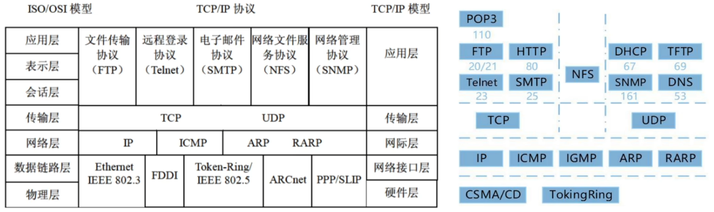
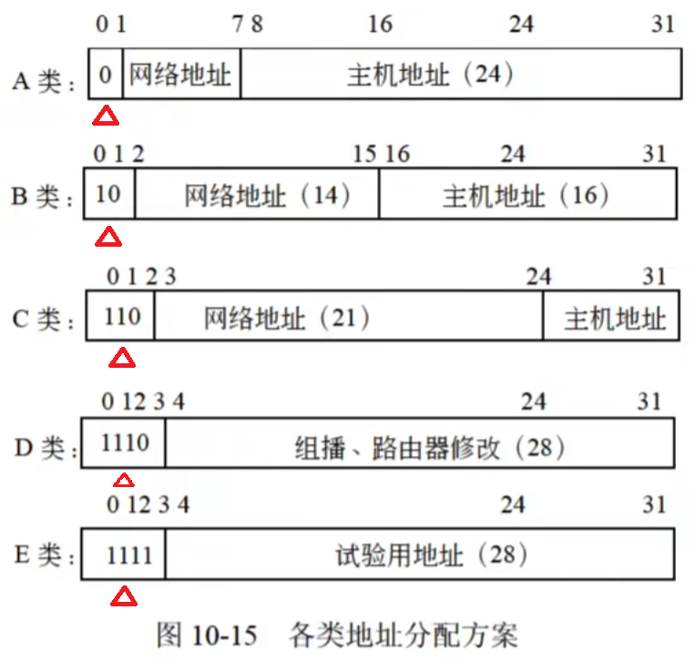

## 11. 计算机网络 - 软件设计师

**网络设备**：

- 物理层的互连设备：中继器、集线器（多端口中继器）
- 数据链路层的互连设备：网桥、交换机（多端口网桥）
- 网络层互连设备：路由器
- 应用层互连设备：网关

|  能否隔离  | 广播域 | 冲突域 |
| :--------: | :----: | :----: |
|   物理层   |   ×    |   ×    |
| 数据链路层 |   ×    |   √    |
|   网络层   |   √    |   √    |

> 物理层的所有端口组成 1 个冲突域和 1 个广播域；数据链路层的 n 个端口形成 1 个广播域和 n 个冲突域

**协议簇**：

> 所有带 T 的除了 TFTP 其他都是 TCP，所有不带 T 的除了 POP3 其他都是 UDP
>
> 协议和层次对应关系题，先排除带 ARP 的

网际层协议：

- IP：不可靠的、无连接的

传输层协议：

- TCP：可靠的、面向连接的、全双工的数据传输服务；三次握手协议
  - 可靠连接、连接管理、差错校验和重传、流量控制（可变大小的滑动窗口协议）、拥塞控制、端口寻址
- UDP：不可靠的、无连接的协议；提高传输的高速率性

**电子邮件**：

E-mail 系统基于客户端/服务器模式

E-mail 服务器主要采用 SMTP（简单邮件传输协议），传输 ASCII 码文本和文字性附件

MIME → 邮件附件扩展类型 POP3 → 接收邮件，每次传输以整个 E-mail 为单位，不能提供部分传输

PEM → 增强私密邮件保护协议 IMAP4 → 交互式数据访问协议

> 简单邮件传送协议和用于接收邮件的 POP3 均是利用 TCP 端口，SMTP 所用端口号是 25，POP3 所用端口号是 110

**ARP**（地址解析协议）：

- 网络层，将 IP 地址转换为物理地址（MAC 地址）
- 广播发送请求（ARP Request），单播传送响应（ARP Response）

**RARP**（反地址解析协议）：网络层，将物理地址（MAC 地址）转换为 IP 地址

**DHCP**（动态主机配置协议）：

- 功能：集中的管理、分配 IP 地址，使网络环境中的主机动态的获得 IP 地址、Gateway 地址、DNS 服务器地址等信息，并能够提升地址的使用率

- DHCP 客户端可以从 DHCP 服务器获得本机 IP 地址、DNS 服务器地址、DHCP 服务器地址和默认网关的地址等

- 无效地址：Windows → 169.254.X.X Linux → 0.0.0.0

  > 169.254.X.X 是 Windows 系统在 DHCP 信息租用失败时自动给客户机分配的 IP 地址

**URL**：协议名://主机名.域名.域名后缀.域名分类/目录/网页文件

| 组织模式 |            含义            | 地理模式（顶级域名） |   含义   |
| :------: | :------------------------: | :------------------: | :------: |
|   com    |          商业组织          |          cn          |   中国   |
|   edu    |          教育机构          |          hk          | 中国香港 |
|   gov    |          政府机构          |          mo          | 中国澳门 |
|   mil    |          军事部门          |          tw          | 中国台湾 |
|   net    |      主要网络支持中心      |          us          |   美国   |
|   org    | 各类组织机构（非盈利团队） |          uk          |   英国   |
|   int    |          国际组织          |          jp          |   日本   |

**浏览器**：

- 本地主机，DNS 域名查询：本地 hosts 文件 → 本地 DNS 缓存 → 本地 DNS 服务器 → 根域名服务器
- 主域名服务器接收域名请求后：本地缓存 → 本地 hosts 文件 → 本地数据库 → 转发域名服务器

**IP 地址和子网掩码**：

IP 地址由 4 个小于 256 的数字组成。Internet 的 IP 地址共 32 位，4 个字节。

有两种表示格式：二进制格式和十进制格式

Internet 中的地址分为 5 类：A 类、B 类、C 类、D 类、E 类；全 0 代表网络，全 1 代表广播

- A 类：网络地址占 1 个字节（8 位），第一个字节的十进制值为 000~127
- B 类：网络地址占 2 个字节，第一个字节的十进制值为 128~191
- C 类：网络地址占 3 个字节，第一个字节的十进制值为 192~223

> 前面几位标识是哪类地址
>
> $可用主机地址=2^{主机地址位数}-2$（1 个全 0 地址和 1 个全 1 地址）
>
> 222.125.80.128/26 → $主机地址位=32-26=6，可用主机地址=2^6-2=62$
>
> 规定子网掩码为 255.255.192.0，则 A 类网络被划分为 1024 个子网
>
> - A 类 →255.0.0.0→11111111 00000000 00000000 00000000
> - 255.255.192.0→11111111 11111111 11000000 00000000
> - 8 位+2 位=10 $2^{10}=1024$
>
> 子网 172.6.32.0/20 被划分为子网 172.6.32.0/26 → 被划分为 $2^{26-20}=2^6=64$ 个子网

**IPv6**：128 位地址空间，$2^{128}$，是 IPv4 的$2^{96}$倍 **IPv4**：32 位地址空间，$2^{32}$

无线网络：蓝牙的覆盖范围最小，通信距离最短

**Windows 命令**：

- ipconfig/release：DHCP 客户端手工释放 IP 地址
- ipconfig/flushdns：清除本地 DNS 缓存内容
- ipconfig/displaydns：显示本地 DNS 内容
- ipconfig/registerdns：DNS 客户端手工向服务器进行注册
- ipconfig：显示所有网络适配器的 IP 地址、子网掩码和缺省网关值
- ipconfig/all：显示所有网络适配器的完整 TCP/IP 配置信息，包括 DHCP 服务是否已启动
- ipconfig/renew：DHCP 客户端手工向服务器刷新请求（重新申请 IP 地址）
- ping：检查网络是否连通，ping 127.0.0.1 → ping 本地 IP → ping 默认网关 → ping 远程主机

**路由**：

Windows 服务器收到一个 IP 数据包时，查找顺序：主机路由 → 网络路由（直连网络和远程网络）→ 默认路由

|                  路由类型                   |                                                说明                                                 |
| :-----------------------------------------: | :-------------------------------------------------------------------------------------------------: |
| 直连网络 ID（Directly attached network ID） |                        用于直接连接的网络，Interface（或 next hop）可以为空                         |
|      远程网络 ID（Remote network ID）       |        用于不直接连接的网络，可以通过其他路由器到达这种网络 Interface 字段是本地路由器的 IP         |
|           主机路由（Host route）            |                           到达特定主机的路由，子网掩码为 255.255.255.255                            |
|          默认路由（Default route）          |                    无法找到确定路由时使用的路由，目标网络和网络掩码都是 0.0.0.0                     |
|        持久路由（Persistent route）         | 利用 route add -p 命令添加的表项，每次初始化时，这种路由都会加入 Windows 的注册表中，同时加入路由表 |

如果路由器收到了由多个路由协议转发的、关于某个目标的多条路由，则比较各个路由的管理距离，采用小的

路由来源 → 管理距离：直连路由 →0；静态路由 →1；EIGRP 汇总路由 →5；外部 BGP→20；内部 EIGRP→90；

IGRP→100；OSPF→110；IS-IS→115；RIP→120；EGP→140；ODR（按需路由）→160；外部 EIGRP→170；

内部 BGP→200；未知 →255
