## 12. 数据结构 - 软件设计师

**大 O 表示法**：

$$
O(1)<O(log_2n)<O(n)<O(nlog_2n)<O(n^2)<O(n^3)<O(2^n)<O(n!)<O(n^n)
$$

​ 常数阶 对数阶 线性阶 线性对数阶 平方阶 立方阶 指数阶 阶乘阶 n 次方阶

- 加法规则：多项相加，保留最高阶项，并将系数化为 1
- 乘法规则：多项相乘都保留，并将系数化为 1
- 加法乘法混合规则：先小括号再乘法规则，最后加法规则

> 示例：$$T(n)=(2n+3)\times{(3n^2+4)}\rightarrow n\times{n^2}\rightarrow O(n^3)$$

**渐进符号**：

- O 记号，渐进上界，$$O(g(n))\geq{f(n)}$$
- ‌Ω 记号，渐进下界，$$Ω(g(n))\leq{f(n)}$$
- ‌Θ 记号，渐进紧致界，当且仅当$$O(g(n))=f(n)$$ 和 $$Ω(g(n))=f(n)$$ 时，$$Θ(g(n))=f(n)$$

> 示例：
>
> $$10n^2+4n+2=O(n^3)$$ ——> √
> $$10n^2+4n+2=O(n)$$ ——> ×
>
> $$10n^2+4n+2=Ω(n)$$ ——> √
> $$10n^2+4n+2=Ω(n^3)$$ ——> ×
>
> $$10n^2+4n+2=Θ(n^2)$$ ——> √
> $$10n^2+4n+2=Θ(n)或Θ(n^3)$$ ——> ×

**递归**：

$递归式时间复杂度=递归次数\times{每次递归的时间复杂度}$（每次递归的时间复杂度不变的情况）

递归式主方法：$$T(n)=aT(\frac{n}{b})+f(n)$$，其中 a≥1 和 b>1 是常数，f(n)是一个渐进的正函数

- 若对于某常数 $$ε>0，有 f(n)=O(n^{log*{b}a+ε})，则 T(n)=Θ(n^{log*{b}a})$$
- 若$$f(n)=Θ(n^{log*{b}a}lg^{k}n)，则 T(n)=Ω(n^{log*{b}a}lg^{k+1}n)$$

**线性结构**：

### 线性表

- 顺序存储：

  - 等概率下 **\_\_\_\_\_** 需要移动的元素个数期望值

    插入一个新元素：$$E*{insert}=\sum*{i=1}^{n+1}P*{i}\times{(n-i+1)}=\frac{1}{n+1}\sum*{i=1}^{n+1}(n-i+1)=\frac{n}{2}$$

    删除元素：$$E*{delete}=\sum*{i=1}^{n}q*{i}\times{(n-i)}=\frac{1}{n}\sum*{i=1}^{n}(n-i)=\frac{n-1}{2}$$

  - 时间复杂度：

| 操作 | 最好 | 最坏 | 平均 |
| :--: | :--: | :--: | :--: |
| 插入 | O(1) | O(n) | O(n) |
| 删除 | O(1) | O(n) | O(n) |
| 查找 | O(1) | O(1) | O(1) |

- 链式存储

  - 数据域用于存储数据元素的值，指针域用于存储当前元素的直接前驱或直接后驱的位置信息

  - 时间复杂度：

| 操作 | 最好 | 最坏 | 平均 |
| :--: | :--: | :--: | :--: |
| 插入 | O(1) | O(n) | O(n) |
| 删除 | O(1) | O(n) | O(n) |
| 查找 | O(1) | O(n) | O(n) |

- 栈：后进先出的线性表

  进行插入和删除操作的一端称为栈顶，另一端称为栈底，不含数据元素的栈称为空栈

- 队列：先进先出的线性表

  允许插入元素的一端称为队尾，允许删除元素的一端称为队头

  循环队列的优点：入队和出队操作不需要移动队列中的其他元素

- 串：仅由字符构成的有限序列

  空串 → 长度为 0 的串，不包含任何字符

  空格串 → 由一个或多个空格组成的串，有长度

  子串 → 由串中任意长度的连续字符构成的序列，空串是任意串的子串

  串比较：从两个串的第一个字符开始进行，字符的码值大者所在的串为大，若其中一个串先结束，则以串长较大者为大

  - 朴素模式匹配：时间复杂度最好$$O(m)$$，最坏$$O(n×m)$$，平均$$O(n+m)$$

  - kmp 算法

    串的前缀：包含第一个字符并且不包含最后一个字符的子串

    串的后缀：包含最后一个字符并且不包含第一个字符的子串

    第 i 个字符的 next 值 = 从 1 ~ i-1 串中最长相等前后缀长度 + 1

    特殊情况：next[1]=0 next[2]=1

    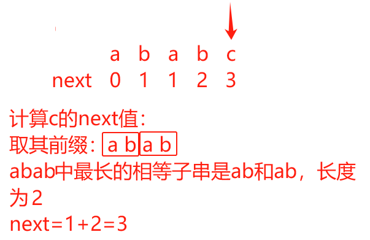

**数组**：

- 一维数组

  下标从 0 开始：$$a_i=LOC+i\times{L}$$

  下标从 1 开始：$$a_i=LOC+(i-1)\times{L}$$

- 二维数组

  按行优先存储

  - 下标从 0 开始：$$a_{i,j}=LOC+(i\times{M}+j)\times{L}$$
  - 下标从 1 开始：$$a_{i,j}=LOC+[(i-1)\times{M}+(j-1)]\times{L}$$

  按列优先存储

  - 下标从 0 开始：$$a_{i,j}=LOC+(j\times{N}+i)\times{L}$$
  - 下标从 1 开始：$$a_{i,j}=LOC+[(j-1)\times{N}+(i-1)]\times{L}$$

> LOC：第一个元素的首地址 N：行数 M：列数 L：元素大小

**矩阵**：

- 对称矩阵

  - 按行存储下三角区和主对角线并且下标从 0（A~0,0~）开始

    当 $$i\geq{j}$$ 时：$$A_{i,j}=\frac{i(i+1)}{2}+j+1$$

    当 $$i\leq{j}$$ 时：$$A_{i,j}=\frac{j(j+1)}{2}+i+1$$

  - 按行存储下三角区和主对角线并且下标从 1（A~1,1~）开始

    当 $$i\geq{j}$$ 时，$$A_{i,j}=\frac{i(i-1)}{2}+j$$

    当 $$i\leq{j}$$ 时，$$A_{i,j}=\frac{j(j-1)}{2}+i$$

- 三对角矩阵

  按行存储并且下标从 0（A~0,0~）开始：$$A_{i,j}=2i+j+1$$

  按行存储并且下标从 1（A~1,1~）开始：$$A_{i,j}=2i+j-2$$

- 稀疏矩阵：进行压缩存储的方式 → 三元组顺序表、十字链表

**树**：

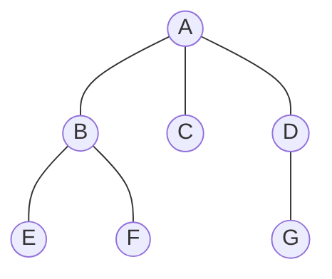

- 双亲结点即是父结点；具有相同双亲的结点为兄弟结点（B、C、D）
- 结点的度：一个结点的子树的个数（A 的度为 3，B 的度为 2）
- 叶子结点：终端结点，即度为 0 的结点（E、F、C、G）
- 分支结点：度不为 0 的结点（B、D）
- 结点的层次：根为第 1 层，根的孩子为第 2 层，以此类推（A 在第 1 层，BCD 在第 2 层，EFG 在第 3 层）
- 树的高度：一棵树的最大层数（上图树的高度为 3）

> 性质 1：$$树中的结点总数=树中所有结点的度数之和+1$$
>
> 性质 2：度为 m 的树中第 i 层上至多有 $$m^{i-1}$$ 个结点（ $$i\geq1$$）
>
> 性质 3：高度为 h 的 m 次树（度为 m 的树）至多有 $$\frac{m^h-1}{m-1}$$ 个结点
>
> 性质 4：具有 n 个结点、度为 m 的树的最小高度为 $$\lceil{log_m(n(m-1)+1)}\rceil$$（向上取整）

**二叉树**：二叉树结点最大度为 2

满二叉树：深度为 k 且有 $$2^k-1$$ 个结点

完全二叉树：深度为 k、有 n 个结点的二叉树，其每一个结点都与深度为 k 的满二叉树中编号从 1 至 n 的结点一一对应

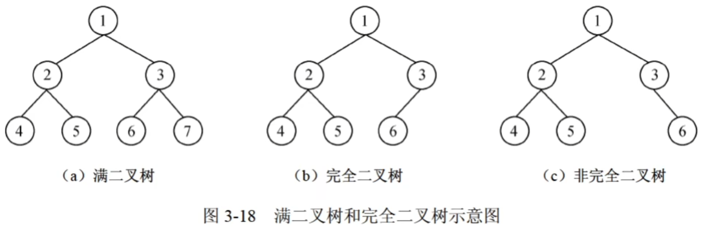

- 二叉树第 $$i$$ 层（$$i\geq{1}$$）上最多有 $$2^{i-1}$$ 个结点
- 高度为 $$h$$ 的二叉树最多有 $$2^h-1$$ 个结点
- 对于任何一棵二叉树，$$度为0的结点数=度为2的结点数+1$$
- 具有 $$n$$ 个结点的完全二叉树的高度为 $$\lfloor{log_2n}\rfloor+1$$（向下取整） 或 $$\lceil{log_2(n+1)}\rceil$$（向上取整）

> 具有 n 个结点的二叉树有 $$\frac{C^{n}_{2n}}{n+1}$$ 种（$$C^{m}_{n}=\frac{n!}{m!\times{(n-m)!}}$$）

- 顺序存储：二叉树有 $n$ 个结点，对于编号为 $i$ 的结点

  - $i=1$时为根节点；$i>1$ 时，该结点的双亲结点为 $\lfloor{i/2}\rfloor$
  - 若 $$2i\leq{n}$$，该结点的左孩子编号为 $$2i$$，否则无左孩子
  - 若 $$2i+1\leq{n}$$，该结点的右孩子编号为 $$2i+1$$，否则无右孩子
  - 最坏情况下，一个深度为 $$k$$ 且只有 $$k$$ 个结点的二叉树（单支树）需要 $$2^k-1$$ 个存储单元

- 链式存储：二叉树有 $$n$$ 个结点，则有 $$n-1$$ 个分支

  - 二叉链表：$$2n$$ 个指针域，其中有效指针域为 $$n-1$$ 个，空指针域为 $$n+1$$ 个

  - 三叉链表：$$3n$$ 个指针域，其中有效指针域为 $$2n-2$$ 个，空指针域为 $$n+2$$ 个

先序遍历：根左右

中序遍历：左根右

后序遍历：左右根

层序遍历：从第 1 层到第 h 层，每层从左到右访问所有结点

> 构造二叉树：中序+先序/后序/层序 → 先序/后序/层序找根，中序辨左右

平衡二叉树：二叉树中的任意一个结点的左右子树高度之差的绝对值不超过 1

二叉排序树：根节点的关键字大于左子树所有结点的关键字，小于右子树所有结点的关键字，左右子树也是二叉排序树，中序遍历得到的是有序序列

最优二叉树（哈夫曼树）：带权路径长度最短的树，路径上的分支数目称为路径长度

带权路径长度之和：$$WPL=\sum^{n}_{k=1}w_kl_k$$（$$n$$为带权叶子结点数目，$$w_k$$为权值，$$l_k$$为叶子节点到根的路径长度）

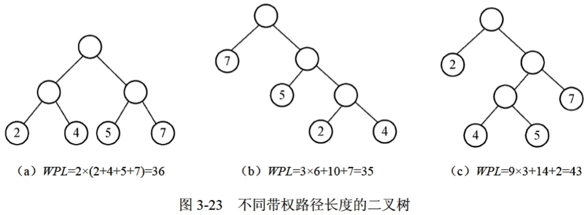

构造最优二叉树：

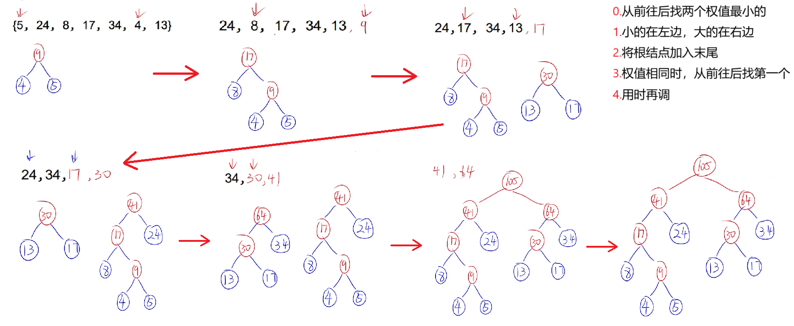

> 固定长度编码：$$2^{固定长度}\geq{字符个数}$$

线索二叉树：与普通二叉树相同，只是改变了存储结构，一般为干扰选项

> 具有 n 个结点的二叉树有 $$\frac{C^n_{2n}}{n+1}$$ 种 （卡特兰数）

**图**：

- 有向图：每条边都是有方向的，顶点之间的关系用<$$v_i,v_j$$>表示，$$v_i$$为起点（弧尾），$$v_j$$为终点（弧头）

- 无向图：每条边都是无方向的，顶点之间的关系用 $$(v_i,v_j)$$或 $$(v_j,v_i)$$ 表示

- 完全图：对于有 n 个顶点的图

  - 完全无向图：每一个顶点与其他 $$n-1$$ 个顶点之间都有边，共有 $$\frac{n(n-1)}{2}$$ 条边
  - 有向完全图：任意两个不同顶点之间都有方向相反的两条弧存在，共有 $$n(n-1)$$ 条弧

- 度：顶点 $$v$$ 的度是指关联于该顶点的边的数目，有向图顶点的度等于该顶点的入度和出度之和

  - 出度：以该顶点为起点的有向边的数目
  - 入度：以该顶点为终点的有向边的数目

  顶点数 $$n$$，边数 $$e$$ 与各顶点的度之间的关系：$$e=\frac{1}{2}\sum^{n}_{i=1}D(v_i)$$

- 路径：从顶点 $$v_p$$ 到顶点 $$v_q$$，路径长度是路径上边或弧的数目

  - 回路或环：第一个顶点和最后一个顶点相同的路径
  - 简单路径：一条路径上除了 $$v_p$$ 和 $$v_q$$ 可以相同外，其余顶点均不相同

- 连通图：无向图中任意两个顶点都是连通的；边数最少为 $$n-1$$，最多为 $$\frac{n(n-1)}{2}$$

- 强连通图：有向图中每对顶点之间存在路径（$$v_i\rightarrow{v_j}$$和$$v_j\rightarrow{v_i}$$）；边数最少为 $$n$$，最多为 $$n(n-1)$$

- 邻接矩阵：无向图的邻接矩阵是对称的；非 0 元素个数，有向图 → e 个，无向图 → 2e 个

  - 无向图中，顶点 $$v_i$$ 的度是邻接矩阵第 $$i$$ 行（或列）中值不为 0 的元素个数
  - 有向图中，第 $$i$$ 行中非 0 元素个数是顶点 $$v_i$$ 的出度，第 $$j$$ 列的非 0 元素个数是顶点 $$v_j$$ 的入度

- 邻接链表：边数为 e，有向图 → $$表结点个数=e$$，无向图 → $$表结点个数=2e$$

- 网：边（或弧）带权值的图

> 稠密图，边多（完全图） → 邻接矩阵 稀疏图，边少 → 邻接表

深度优先遍历（DFS）：栈+递归，邻接矩阵 → $$O(n^2)$$ 邻接表 → $$O(n+e)$$

广度优先遍历（BFS）：队列，邻接矩阵 → $$O(n^2)$$ 邻接表 → $$O(n+e)$$

**拓扑排序**：AOV 网 → 有向无环图

- 在 AOV 网中选择一个入度为 0（没有前驱）的顶点且输出它
- 从网中删除该顶点及与该顶点有关的所有弧
- 重复上述两步，直到网中不存在入度为 0 的顶点为止

> 在有向无环图 G 的拓扑序列中，顶点 $$v_i$$ 在 $$v_j$$ 之前，则：
>
> - 可能存在弧 <$$v_i,v_j$$> ，一定不存在弧度 <$$v_j,v_i$$>
> - 可能存在 $$v_i$$ 到 $$v_j$$ 的路径，一定不存在 $$v_j$$ 到 $$v_i$$ 的路径

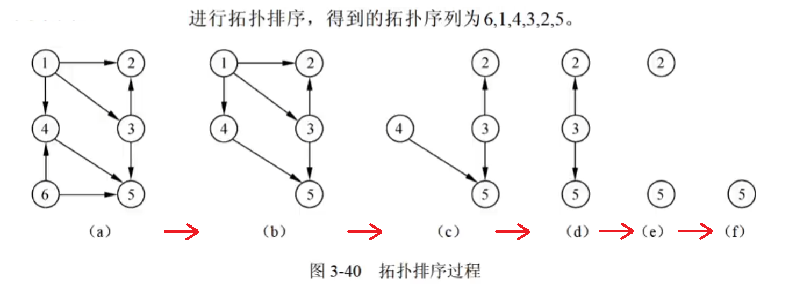

**查找**：

- 静态查找表：

  - 顺序查找：适用于顺序存储和链式存储，不需要元素有序

    平均查找长度：$$ASL*{ss}=\sum^{n}*{i=1}P*iC_i=\frac{1}{n}\sum^{n}*{i=1}(n-i+1)=\frac{n+1}{2}$$

    > $$P_i$$ 为对表中第 $$i$$ 个记录进行查找的概率，$$C_i$$ 为找到第 $$i$$ 个记录时已进行过比较的关键字个数

  - 折半（二分）查找：适用于顺序存储，元素有序排列

    最多比较次数：$$\lfloor{log_2n}\rfloor+1$$ 次

    平均查找长度：$$ASL*{bs}=\sum^{n}*{j=1}P*iC_i=\frac{1}{n}\sum^{n}*{j=1}j\times{2^{j-1}}=\frac{n+1}{n}log_2(n+1)-1$$

    > 当 n 值较大时，$$ASL_{bs}\approx{log_2(n+1)-1}$$

    平均查找长度：查找成功 → $$\frac{\sum^{n}_{i=1}(i\times{第 i 层结点数})}{总结点数}$$ 查找失败 → $$\frac{\sum^{n}_{i=1}[(i-1)\times{第 i 层的外结点数}]}{外结点总数}$$

    平均比较次数：

    - 查找成功 → $$\frac{\sum^n*{i=1}(第 i 层的比较次数\times{第 i 层的结点数})}{总节点数}$$ 查找失败 → $$\frac{\sum^n*{i=1}(第 i 层比较次数\times{第 i 层的外结点数})}{总外节点数}$$

    > 对于下面的树，位于第 $$i$$ 层即为需要比较 $$i$$ 次
    >
    > 图中红色结点即为外结点（为空），$$外结点总数=结点数+1$$
    >
    > 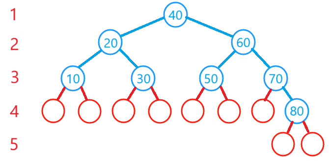

  - 分块查找

- 动态查找表：

  - 二叉排序树

  - 平衡二叉树

  - B-树

  - 哈希表：冲突只能尽可能减少而不能完全避免

    具有相同哈希函数值的关键字对该哈希函数来说称为同义词

    - 哈希函数：除留余数法，尽可能使关键字的所有组成部分都能起作用

    - 处理冲突：开放定址法 → $$H_i=(H(key)+d_i)\bmod{m}$$，m 为表长，$$d_i$$ 为增量序列

      > ① $$d_i=1,2,3,...,m-1$$，称为线性探测法
      >
      > ② $$d_i=1^2,-1^2,2,-2^2,3,-3^2,...,\pm{k^2}$$（$$k\leq{\frac{m}{2}}$$），称为二次探测法

      链地址法 → 发生冲突的记录链接在一个链表内

    - 装填因子：$$\alpha=\frac{表中装入的记录数}{哈希表的长度}$$

      > $$\alpha$$ 越小，发生冲突的可能性越小，反之亦然

**堆**：n 个关键码构成的序列 $$\{k_1,k_2,...,k_n\}$$，对于第 $$i$$ 个关键码有

- 小顶堆：

$$
\left\{
	\begin{array}{l}
		k_i \leq k_{2i} \\
		k_i \leq k_{2i+1}
	\end{array}
\right.
$$

- 大顶堆：

$$
\left\{
	\begin{array}{l}
		k_i \geq k_{2i} \\
		k_i \geq k_{2i+1}
	\end{array}
\right.
$$

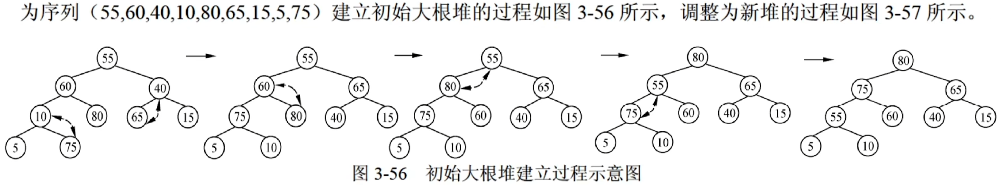

**排序**：需要进行两种基本操作 → 比较两个关键字的大小；将记录从一个位置移动到另一个位置

- 内部排序：排序记录全部存放在内存中进行排序
- 外部排序：排序记录数量大，内存不能全部容纳，需对外存进行访问

> 对于 (3，21，1，22，5) → (1，22，21，3，5)，排序后 2 的相对次序变化了（第 2 个 2 到了第 1 个 2 的前面），则此类排序为不稳定的
>
> 归位：一趟排序就可确定某个元素的位置

|   排序算法   | 平均时间复杂度 | 最坏时间复杂度 | 最好时间复杂度 |  空间复杂度   | 稳定性 |
| :----------: | :------------: | :------------: | :------------: | :-----------: | :----: |
| 直接插入排序 |   $$O(n^2)$$   |   $$O(n^2)$$   |    $$O(n)$$    |   $$O(1)$$    |  稳定  |
|   希尔排序   | $$O(n^{1.3})$$ |   $$O(n^2)$$   |    $$O(n)$$    |   $$O(1)$$    | 不稳定 |
| 简单选择排序 |   $$O(n^2)$$   |   $$O(n^2)$$   |   $$O(n^2)$$   |   $$O(1)$$    | 不稳定 |
|    堆排序    | $$O(nlog_2n)$$ | $$O(nlog_2n)$$ | $$O(nlog_2n)$$ |   $$O(1)$$    | 不稳定 |
|   冒泡排序   |   $$O(n^2)$$   |   $$O(n^2)$$   |    $$O(n)$$    |   $$O(1)$$    |  稳定  |
|   快速排序   | $$O(nlog_2n)$$ |   $$O(n^2)$$   | $$O(nlog_2n)$$ | $$O(log_2n)$$ | 不稳定 |
|   归并排序   | $$O(nlog_2n)$$ | $$O(nlog_2n)$$ | $$O(nlog_2n)$$ |   $$O(n)$$    |  稳定  |

- 直接插入排序：数组基本有序时，比较次数最少

  

- 计数排序：适用于一组记录的关键字的取值均在 0 到 9 之间

  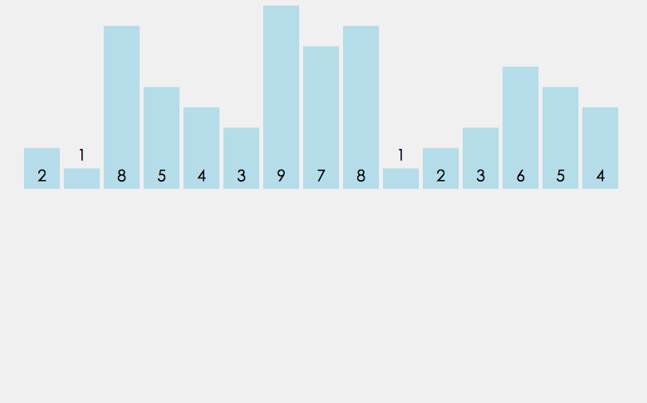

- 简单选择排序：**归位**，每次遍历找出剩余部分中的最小值并排到前面位置

  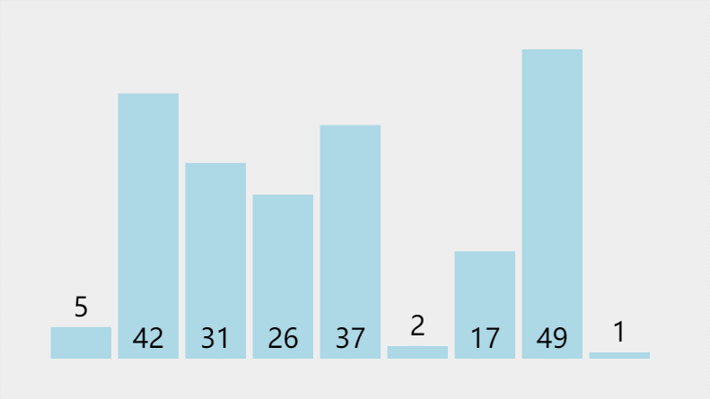

- 堆排序：**归位**，构建大/小顶堆，找出最大/小值排到后面位置，重复上述步骤

  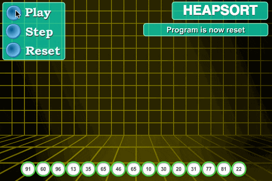

- 冒泡排序：**归位**

  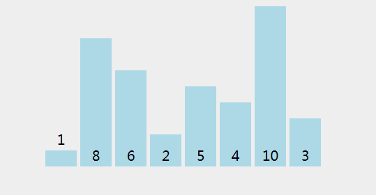

- 快速排序：**归位**，分治算法

  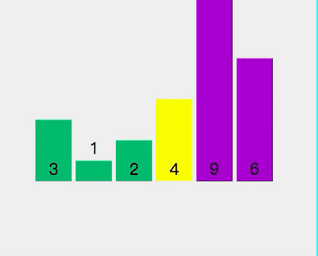

- 归并排序：分治法，元素基本有序时，比较次数最少

  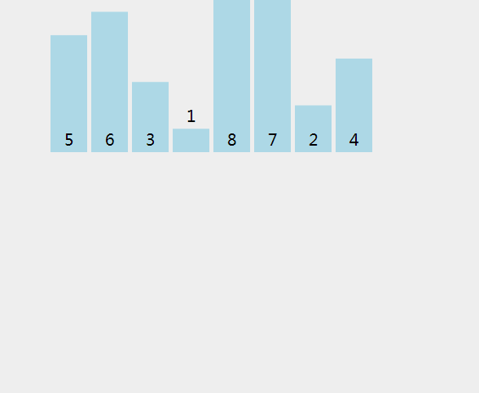
