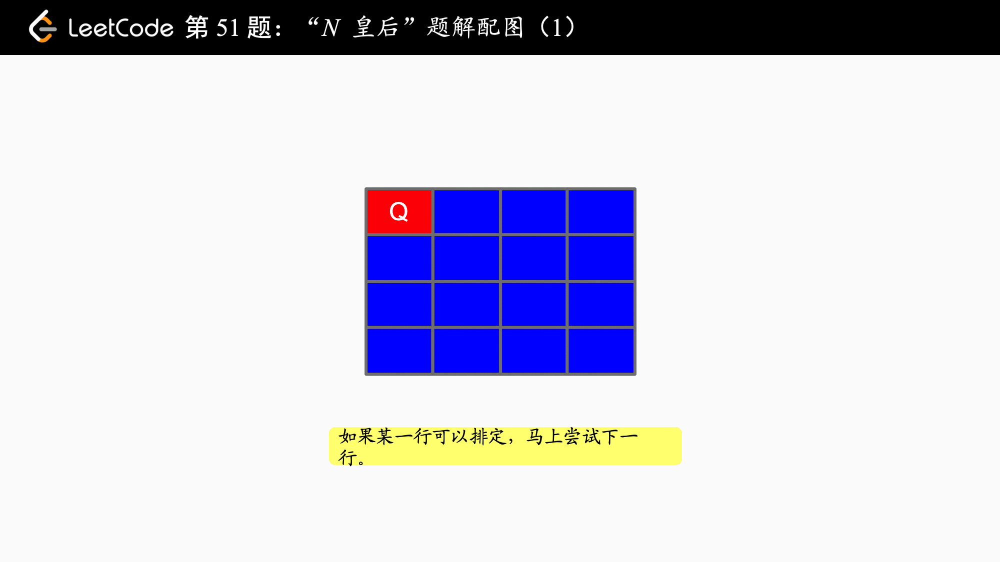
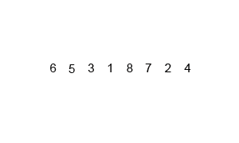
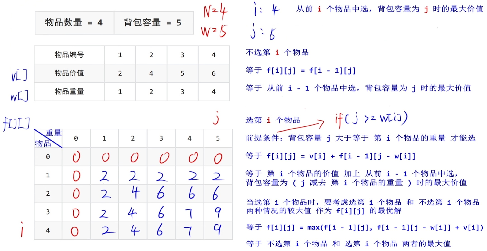
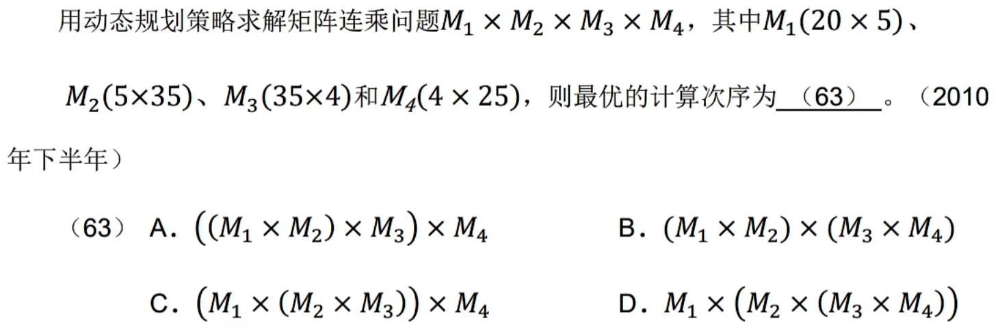
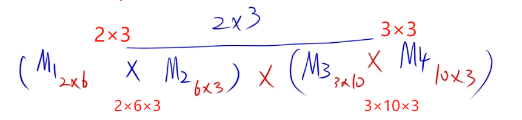
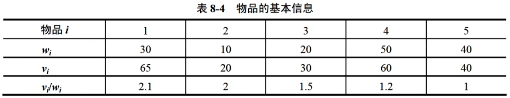

## 13. 算法 - 软件设计师

**回溯法**：

- 深度优先

- N 皇后问题：在 N×N 的棋盘上摆放 N 个皇后，并且满足 N 个皇后中任意两个皇后都不处于同一行、同一列、同一斜线（正斜线、反斜线）上，，对于皇后 $Q_i$ 和皇后 $Q_j$ ：

  - 判断是否位于同一列：$$Q_{i列}=Q_{j列}$$
  - 判断是否位于同一斜线：$$|Q_{i行}-Q_{j行}|=|Q_{i列}-Q_{j列}|$$

  > 对于下图，方案 1：2,4,1,3 方案 2：3,1,4,2 数字表示当前皇后位于第几列

  

**分治法**：分解 → 求解 → 合并

- 归并排序（递归）：由

  $$
  T(n)=\left\{
  	\begin{array}{l}
  		O(1)\qquad\qquad\qquad n\leq{1} \\
  		2T(\frac{n}{2})+O(n)\qquad n>1
  	\end{array}
  \right.
  $$

  解得 $T(n)=O(nlogn)$

- 最大子段和：序列中所有整数均为负整数时，其最大字段和为 0

**动态规划**：全局最优解，① 最优子结构 ② 重叠子问题

- 0-1 背包问题：有 $N$ 个物品，第 $i$ 个物品价值为 $v_i$，重量为 $w_i$，背包容量为 $W$（均为非负数），现需要考虑如何选择装入背包的物品，使装入背包的物品总价值最大

  时间复杂度和空间复杂度：$O(N\times{M})$

  

- 最长上升公共子序列

- 矩阵连乘：时间复杂度 → $O(n^3)$ 空间复杂度 → $O(n^2)$

  

  > 技巧：优先消除大的数
  >
  > 1. $M_2\times{M_3}=(5\times{35})\times(35\times{4})\rightarrow{5\times{4}}$，消除最大的 35
  > 2. $M_1\times(M_2\times{M_3})=(20\times{5})\times(5\times{4})\rightarrow{20\times{4}}$，消除 5 和 4 中较大的 5
  > 3. $(M_1\times(M_2\times{M_3}))\times{M_4}=(20\times{4})\times(4\times{25})\rightarrow{20\times{25}}$
  > 4. 故选 C
  >
  > 四个矩阵$M_1$、$M_2$、$M_3$、$M_4$ 相乘的维度序列为 2、6、3、10、3，则：
  >
  > - $M_1=2\times{6}$ 、$M_2=6\times{3}$ 、$M_3=3\times{10}$ 、$M_4=10\times{3}$
  > - 结果：$$M_1\times{M_2}\rightarrow(M_1\times{M_2})_{2\times{3}}$$（约去 6）
  > - 乘法次数：$(M_1\times{M_2})\times(M_3\times{M_4})=2\times{6}\times{3}+3\times{10}\times{3}+2\times{3}\times{3}=144$
  >
  > 

**贪心法**：局部最优解，① 最优子结构 ② 贪心选择性质

- 部分背包问题：有 n=5 个物品，背包容量为 W=100，可以装一部分到背包中

  时间复杂度：$O(nlog_2n)$，度量标准：

  - 按最大价值先放背包的原则
  - 按最小重量先放背包原则
  - 按最大单位重量价值先放背包的原则（最优解）

  

- 活动选择

**分支限界法**：

- 广度优先
