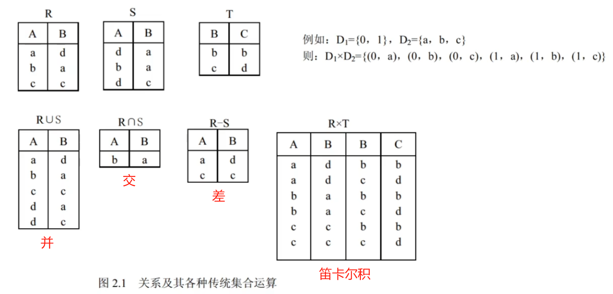
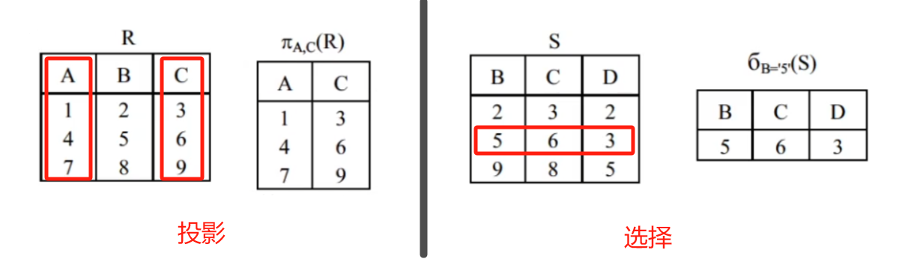
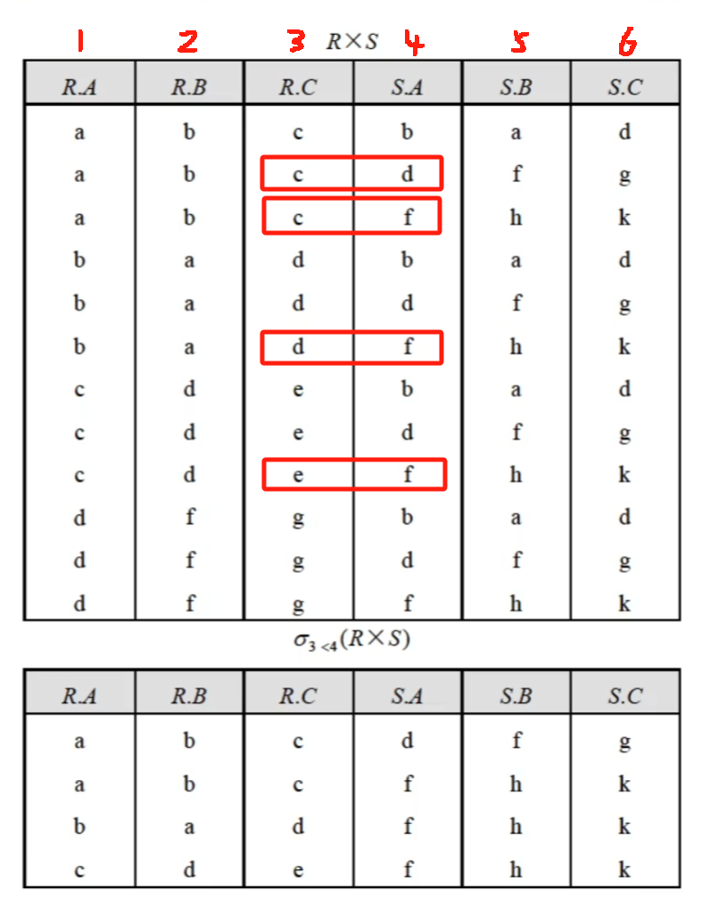
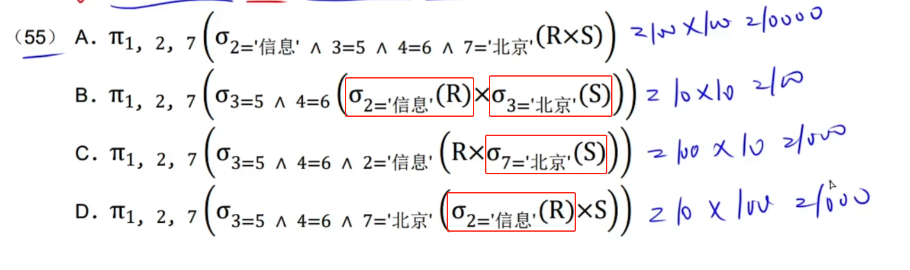
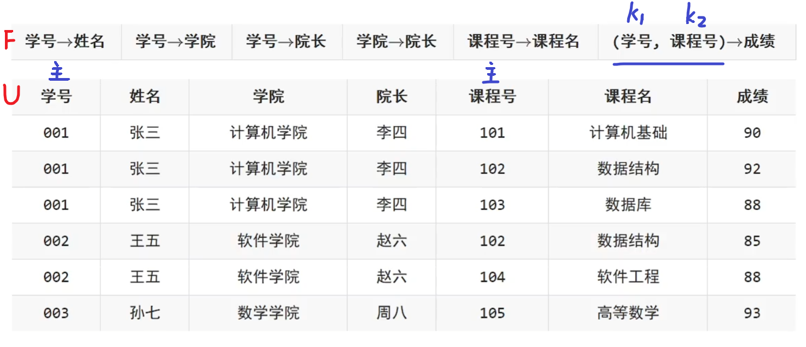
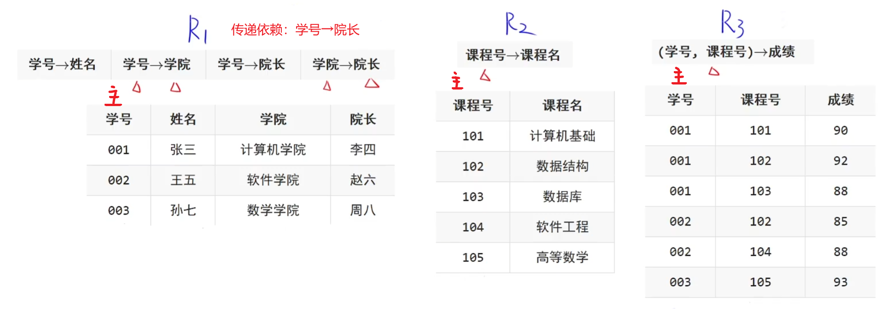
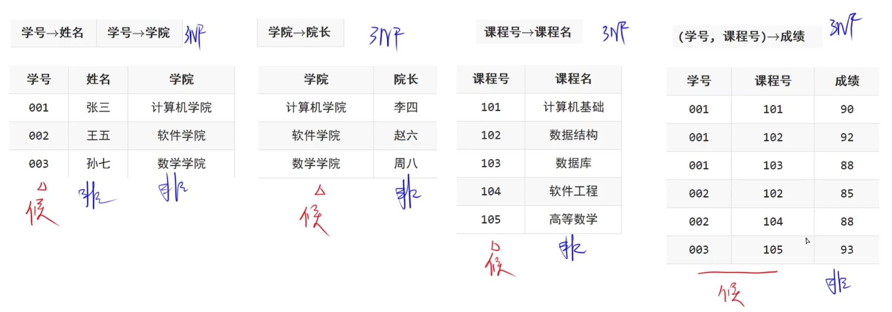
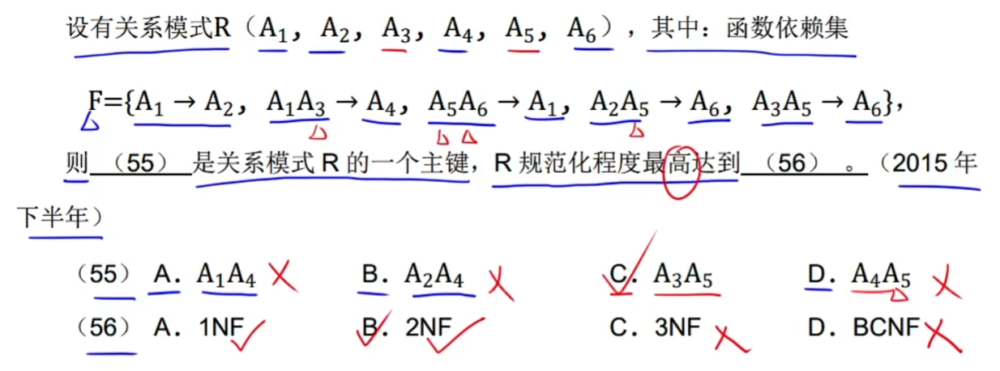
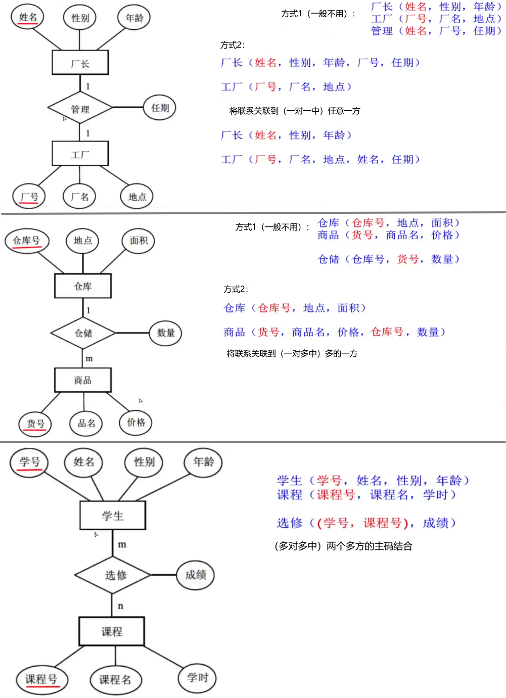

## 3. 数据库 - 软件设计师

两个实体型之间的联系：

- 一对一联系（$1:1$）
- 一对多联系（$1:n$）
- 多对多联系（$m:n$）

关系模型：采用二维表格结构表达实体类型及实体间联系的数据模型

属性：

1. 简单属性和复合属性
   - 复合属性可以拆分成多个属性
2. 单值属性和多值属性
   - 多值属性可能对应一组值：职工可能有多个亲属
3. NULL 属性
   - 表示某个属性上没有值或属性值未知
4. 派生属性
   - 派生属性可由其他属性得来：通过生日和当前时间得出年龄

概念模式 → 基本表

外模式 → 视图

内模式 → 存储文件

- 为了保证数据的**物理独立性**，需要修改概念模式和内模式之间的映像
- 为了保证数据的**逻辑独立性**，需要修改外模式和概念模式之间的映像

1. 关系的并：关系 R 和关系 S 的所有元组合并，再删去重复的元组，组成一个新关系
2. 关系的差：关系 R 和关系 S 的差是由属于 R 而不属于 S 的所有元组组成的集合，即关系 R 中删去与关系 S 中相同的元组
3. 关系的交：关系 R 和关系 S 的交是由既属于 R 又属于 S 的元组组成的集合，即在两个关系 R 与 S 中取相同的元组
4. 笛卡尔积：两个关系相乘

- 投影：投影运算是从关系的垂直方向进行运算，在关系 R 中选出若干属性列 A 组成新的关系
- 选择：选择运算是从关系的水平方向进行运算，是从关系 R 中选择满足给定条件的诸元组

- θ 连接：R×S 中选取属性间满足一定条件的元组（例：$R.A<S.A$）

- 等值连接：当 θ 为 = 时，例：$R.A=R.B$

- 自然连接：去除重复属性的等值连接，没有重复属性时连接结果为空集，例：

  - $R_1(ABC)⋈R_2(ED)⋈R_3(ACE)→R_1⋈R_3=ABCE→ABCE⋈R_2=ABCDE$
  - $R_1(AC)⋈R_2(ED)⋈R_3(B)→(R_1⋈R_3=\varnothing)⋈R_2=\varnothing$

  

  

> SQL 语言：
>
> - 投影 _π_ → select
> - 选择 σ → where
> - 笛卡尔积 R×S → from R,S
> - 自然连接 ⋈ → where R.A=S.A and R.B=S.B
>
> 当 R 和 S 都进行了筛选时，查询效率最高：
>
> 

属性闭包计算：

给定关系模式 $$R<U,F>，U=\{A,B,C\}，F=\{AB→C,C→B\}$$。

关系**R**有 2 个候选关键字 AC 和 AB，且分别有 0 个非主属性和 3 个主属性

> 解题：
>
> - 在**F**中，B 和 C 是被决定的，而 A 不能被任何属性决定，所以先确定候选关键字包含 A
> - $(AC)^+→(ACB)=U$ $(AB)^+→(ABC)=U$
> - 包含在候选关键字中的就是主属性，即 A、B、C

候选码：关系中的一个属性或属性组的值能够唯一地标识一个元组，且它的子集不能唯一的标识一个元组

1. 部分函数依赖：依赖于候选码（多个属性组成）中的一个，例：

   - $(a,b)→c$ 是完全函数依赖，候选码为$(a,b)$
   - $a→d$ ，$a→e$ 为部分函数依赖，因为非主属性 d 和 e 依赖于候选码的一部分 $(a)$
   - 当候选码是单个属性时，可以确定没有部分函数依赖

2. 传递函数依赖：
   - 通过 $a→b$，$b→c$ 推出 $a→c$
   - 伪传递率：若$X→Y$，$(W,Y)→Z$，则有$(X,W)→Z$

- 第一范式（1NF）：R 中每一个属性是不可分割的数据项

  

  > 1NF 不能排除数据冗余和更新异常等问题，因为其中可能存在部分函数依赖

- 第二范式（2NF）：R 是 1NF，且每个非主属性都完全函数依赖于候选码

  

  > 2NF 也可能存在数据冗余和更新异常等问题，因为其中可能存在传递函数依赖

- 第三范式（3NF）：R 是 2NF，且每个非主属性都非传递函数依赖于候选码

  

  > 3NF 的关系模式 R 可能存在主属性对码的部分依赖和传递依赖

- BC 范式（BCNF）：当且仅当 F 中每个依赖的决定因素必定包含 R 的某个候选码

  - 所有非主属性对每一个码都是完全函数依赖
  - 所有的主属性对每一个不包含它的码，也是完全函数依赖
  - 没有任何属性完全函数依赖于非码的任何一组属性

  > 一个满足 BCNF 的关系模式 R 已消除了插入和删除异常

- 第四范式（4NF）：消除多值依赖

例题：

> 解题思路：
>
> 1. $A_1,A_2,A_4,A_6$ 出现在 → 右边，$A_3,A_5$ 没有被任何属性决定，因此候选码包含$A_3A_5$，结合选项可知选 C（可由$A_3A_5$通过 F 验证是否能推出 R）
>
> 2. 检查是否存在某个非主属性（$A_1,A_2,A_4,A_6$）依赖于候选码的单个属性（$A_3或A_5$）：
>
>    - $A_3→{}?$
>    - $A_5→{}?$
>
>    通过 F 可知不存在上述情况（部分函数依赖），满足 2NF
>
> 3. 由$A_3A_5→A_6$（$X→Y$）和$A_5A_6→A_1$（$WY→Z$）可以推出$A_3A_5→A_1$（$XW→Z$）
>
>    - $A_5(A_3A_5)→A_1$去除重复的$A_5$
>
>    此时根据$A_3A_5→A_1$和$A_1→A_2$可知存在传递函数依赖，不满足 3NF

- **1NF (第一范式)：**
  - 目的：消除重复组。
  - 要求：确保表中的每一列都是原子的，即不可再分的最小单位。
  - 解决的问题：重复字段组，如地址、电话号码等。
- **2NF (第二范式)：**
  - 前提：已经满足 1NF。
  - 目的：进一步减少数据冗余，确保非主键列完全依赖于整个主键。
  - 要求：在没有复合主键的情况下，所有的非主键列都必须完全依赖于单一的主键，而不是主键的一部分。
  - 解决的问题：部分依赖导致的数据冗余。
- **3NF (第三范式)：**
  - 前提：已经满足 2NF。
  - 目的：消除非主键列之间的传递依赖。
  - 要求：非主键列不能依赖于其他非主键列，而只能直接依赖于主键。
  - 解决的问题：由于传递依赖导致的数据冗余和更新异常。
- **4NF (第四范式)：**
  - 前提：已经满足 3NF。
  - 目的：消除非平凡的多值依赖。
  - 要求：除了候选键之外，不存在其他依赖于整个候选键的多值集合。
  - 解决的问题：多值依赖，即一个非主键列的值集依赖于另一个非主键列的值集，而不是直接依赖于主键。

数据库设计：用户需求分析 → 概念设计 → 逻辑设计 → 物理设计

1. 需求分析：需求说明文档、数据字典、数据流程图

1. 概念结构设计：属性冲突、命名冲突、结构冲突

1. 逻辑结构设计：

   - E-R 图关系模式转换

     

1. 物理设计

封锁：

- 排他锁：事务 T 对数据对象 A 加上排他锁，则其他事务都不能再对 A 加任何类型的锁
- 共享锁：事务 T 对数据对象 A 加上共享锁，则其他事务只能再对 A 加共享锁

分布式数据库：

- **分片**透明：指用户或应用程序不需要知道逻辑上访问的表具体是怎么分块存储的
- **复制**透明：指采用复制技术的分布方法，用户不需要知道数据是复制到哪些节点，如何复制的。
- **位置**透明：指用户无须知道数据存放的物理位置
- **逻辑**透明：指用户或应用程序无需知道局部场地使用的是哪种数据模型
- **共享**性：指数据存储在不同的结点数据共享
- **自治**性：指每结点对本地数据都能独立管理
- **可用**性：指当某一场地故障时，系统可以使用其他场地上的副本而不至于使整个系统瘫痪
- **分布**性：指数据在不同场地上的存储
