## 5. UML - 软件设计师

**事物**：对模型中最具有代表性的成分的抽象

- 结构事物

  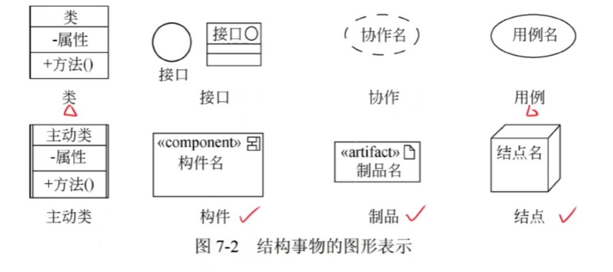

- 行为事物

  - 交互

  - 状态机

  - 活动

    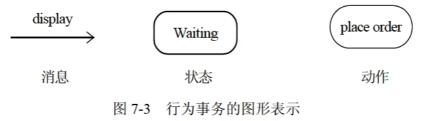

- 分组事物

  - 是 UML 模型的组织部分
  - 最主要的分组事物是包

- 注释事物

  - 是 UML 模型的解释部分

  - 注解是一种主要的注释事物

    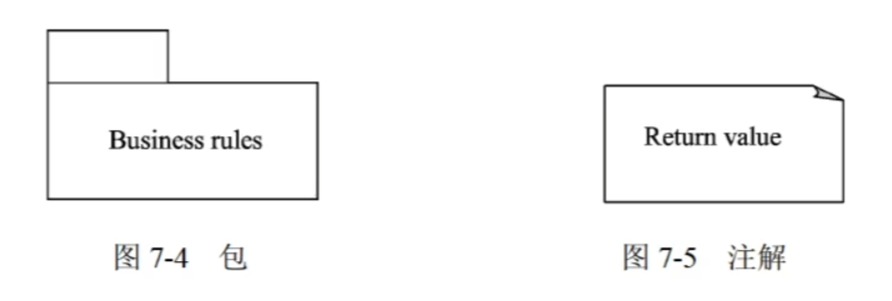

**关系**：把事物结合在一起

- 依赖：一个事物（独立事物）发生变化会影响另一个事物（依赖事物）

  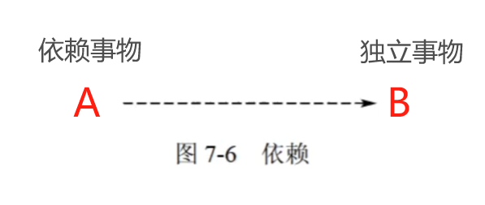

- 关联：一种结构关系，描述了一组链，链是对象之间的连接

  关联上可以标注重复度（多重度）和角色

  - 多重度：一个类的实例能够与另一个类的多少个实例相关联

  - 聚合：部分和整体的生命周期不一致，整体消失，部分仍然存在，部分可以脱离整体存在
  - 组合：部分和整体的生命周期一致，整体消失，部分也存在，部分不可以脱离整体而存在

  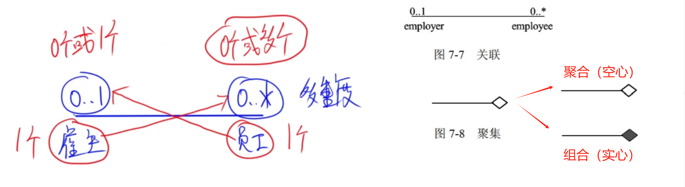

  > 图中交叉关联：1 个雇主对应 0 个或多个员工，1 个员工对应 0 个或 1 个雇主

- 泛化：一种特殊/一般关系，特殊元素（子元素）的对象可替代一般元素（父元素）的对象；子元素共享了父元素的结构和行为

  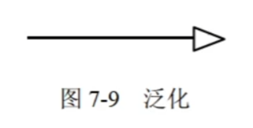

- 实现：一个类元指定了由另一个类元保证执行的契约

  使用实现关系的情况：

  - 在接口和实现它们的类或构件之间
  - 在用例和实现它们的协作之间

  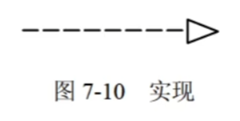

**图**：聚集了相关的事物

- 类图

  - 包括内容：类，接口，协作，依赖、泛化和关联关系

  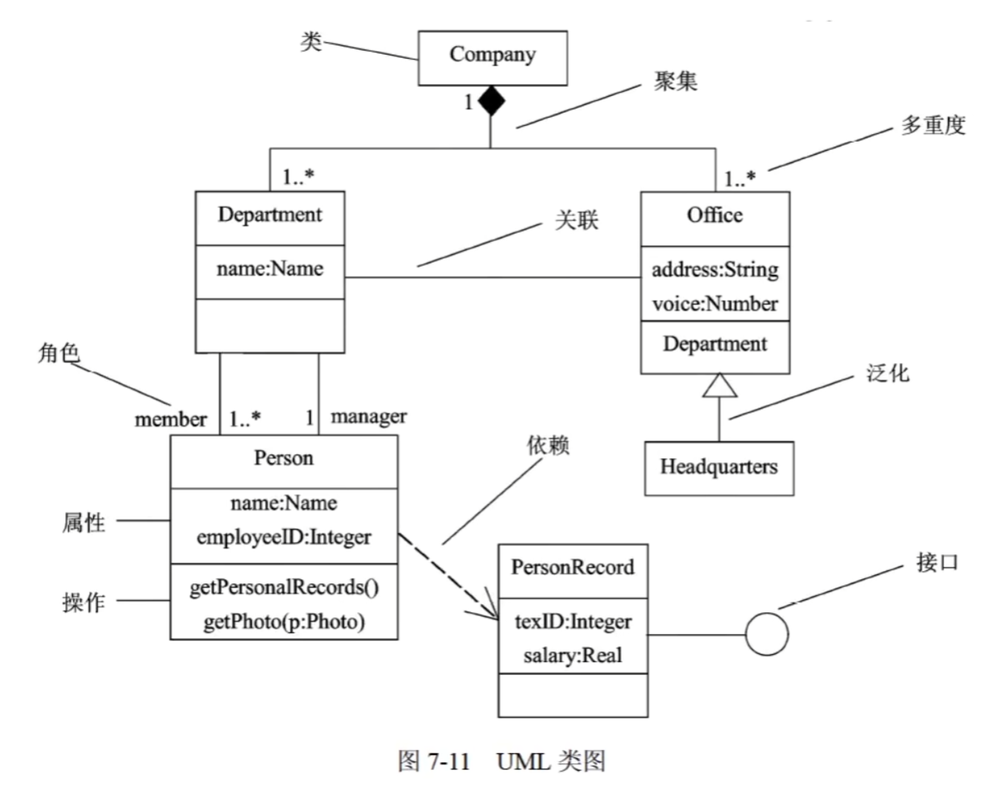

  - 使用类图的方式：
    1. 对系统的词汇建模
    2. 对简单的协作建模
    3. 对逻辑数据库模式建模

- 对象图：某一时刻一组对象以及它们之间的关系

  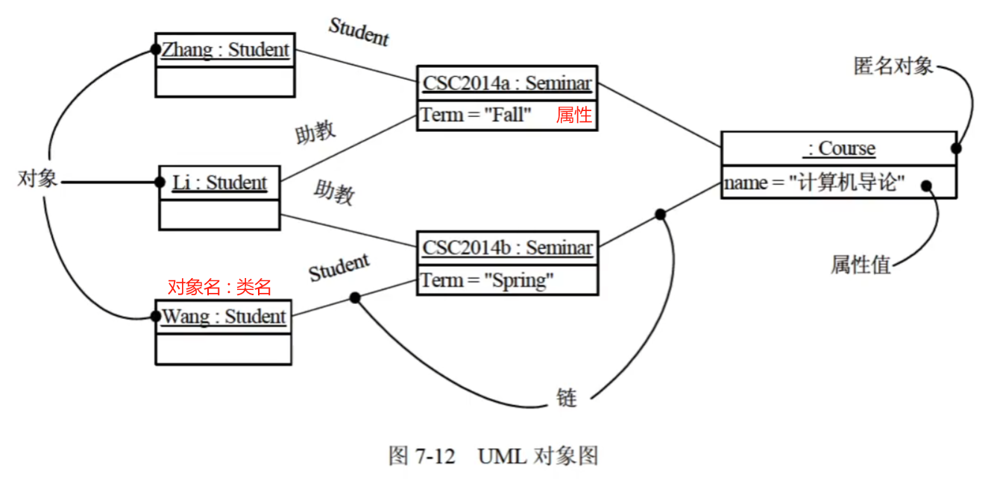

- 用例图：一组用例、参与者以及它们之间的关系

  - 包括内容：

    1. 用例
    2. 参与者
    3. 用例之间的 **扩展关系<\<extend>>** 和 **包含关系<\<include>>** ，参与者和用例之间的**关联**关系，用例与用例以及参与者与参与者之间的**泛化**关系

    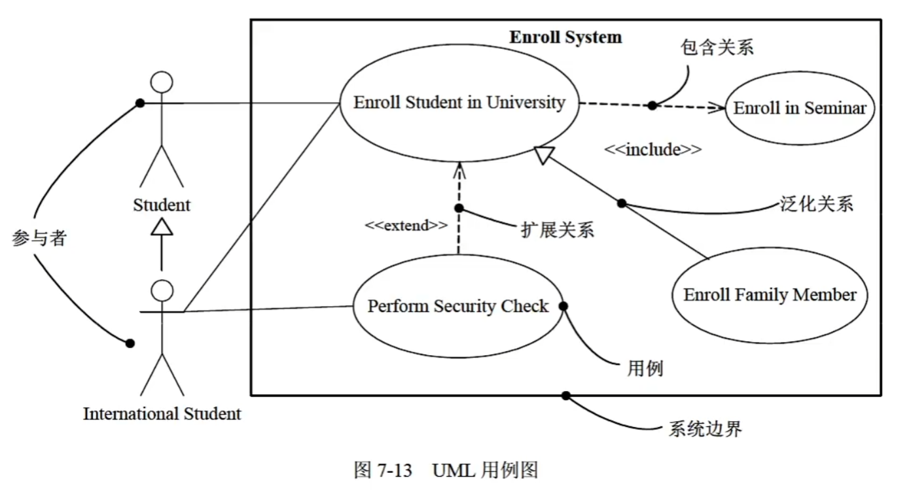

  - 包含关系：

    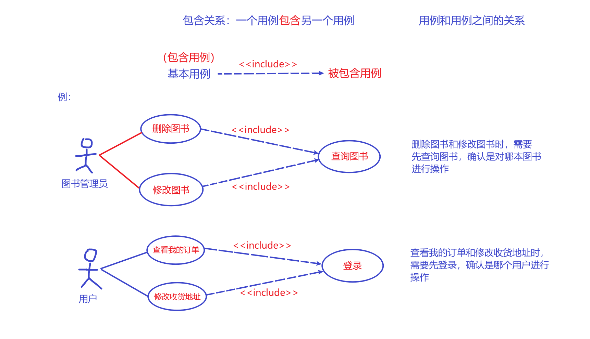

  - 扩展关系：

    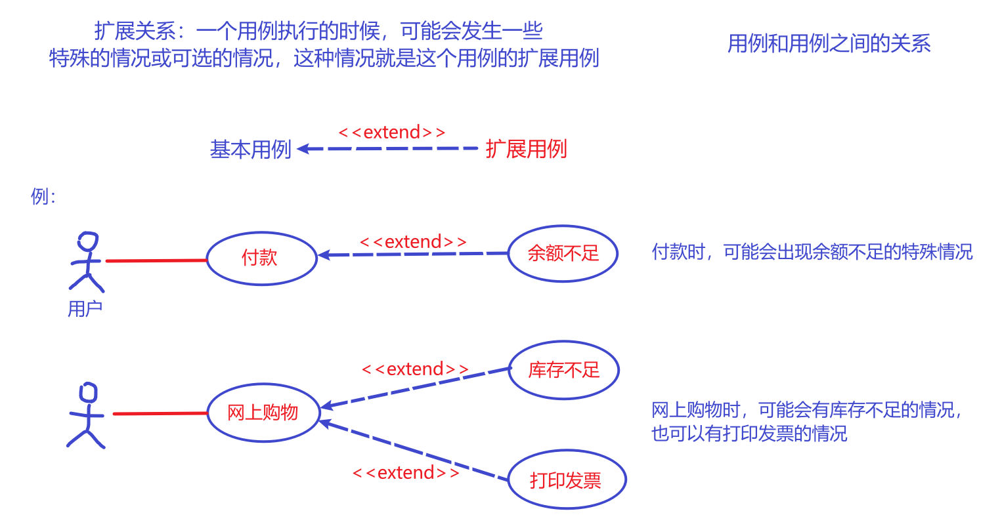

  - 泛化关系：

    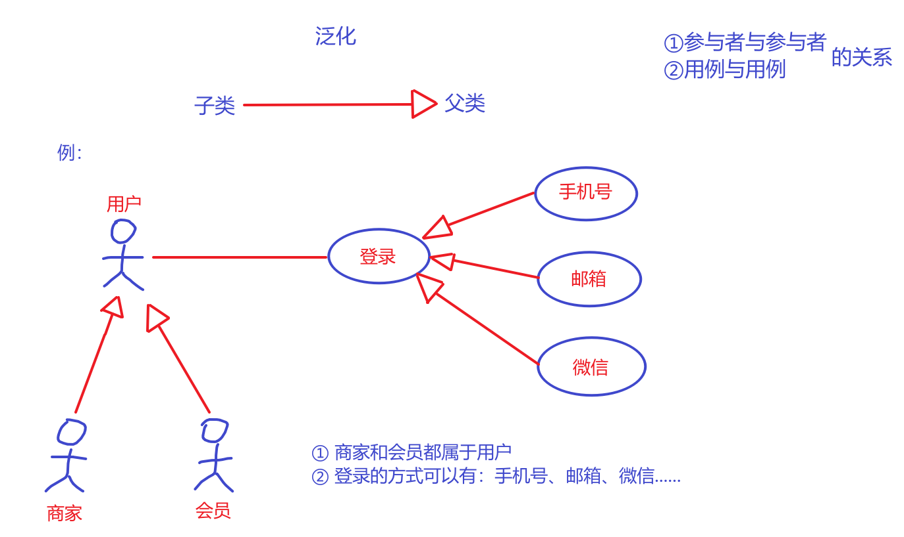

- 交互图：用于对系统的动态方面进行建模

  - 包括内容：对象、链和消息

  - 序列图（顺序图）：强调消息时间顺序

    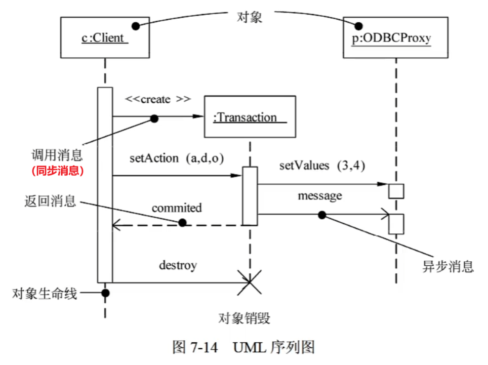

    > 序列图不同于通信图的特征：
    >
    > 1. 序列图有对象生命线（垂直虚线），表示一个对象在一段时间内存在
    > 2. 序列图有控制焦点（瘦高矩形），表示一个对象执行一个动作所经历的时间段，可以是直接执行或通过下级过程执行；矩形顶部表示动作开始，底部表示动作结束

  - 通信图（协作图）：强调接收和发送消息的对象的结构组织，展现了对象之间的消息流及其顺序

    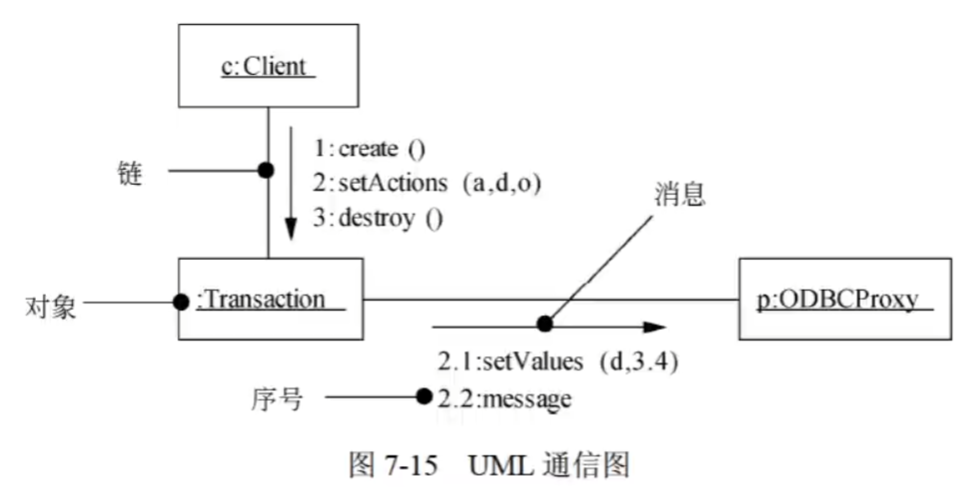

    > 特性：
    >
    > 1. 通信图有路径
    > 2. 通信图有顺序号

- 状态图：强调对象行为的事件顺序（反应型对象建模），关注系统的动态视图

  - 状态：规定了系统对事件的响应方式

    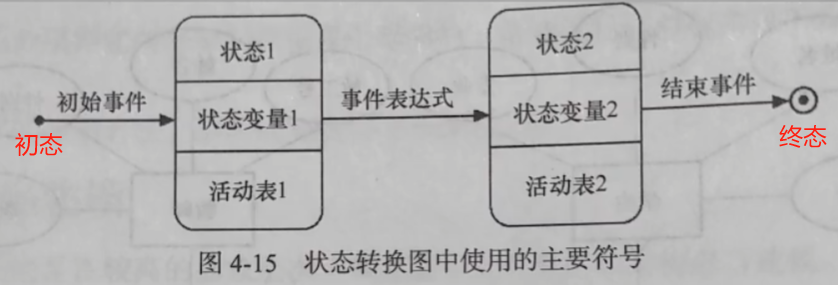

  - 活动

    活动表的语法格式：$事件名(参数表)/动作表达式$

    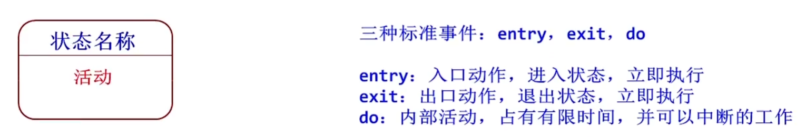

  - 事件

    事件表达式的语法：$事件说明[监护条件]/动作表达式$

    事件说明的语法：$事件名(参数表)$

  - 转换（迁移）：由事件触发

    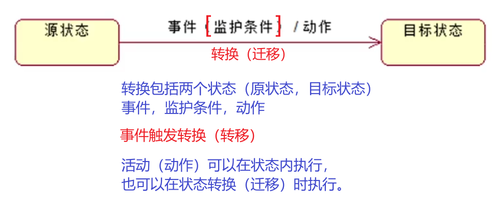

- 活动图：强调对象间的控制流程，专注于系统的动态视图

  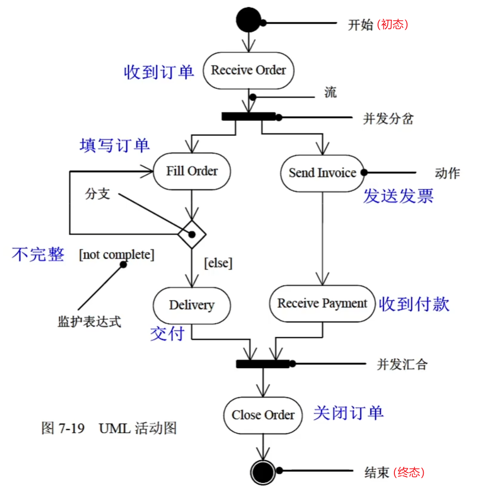

  - 一般包括：活动状态和动作状态、转换和对象
  - 可以表示：分支、合并、分岔和汇合
  - 使用活动图的方式：
    1. 对工作流建模
    2. 对操作建模

- 构件图（组件图）：展现了一组构件（组件）之间的组织和依赖，专注于系统的静态实现视图

  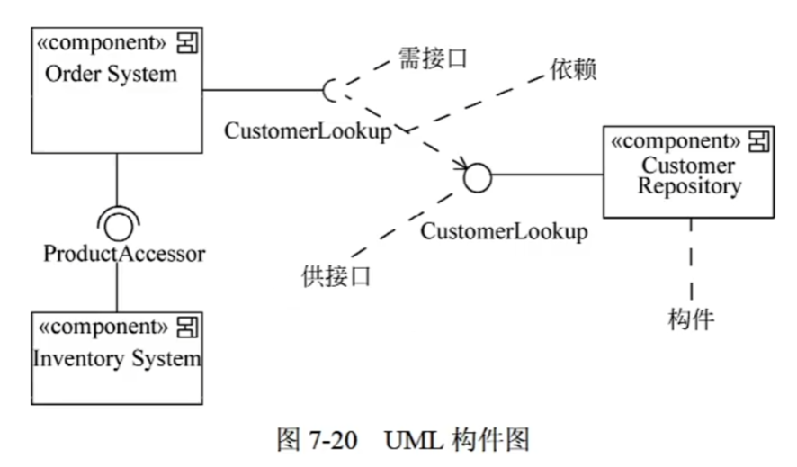

- 部署图：对面向对象系统的物理方面建模的方法，对系统的静态部署视图进行建模

  展现了系统的软件和硬件之间的关系，在实施阶段使用

  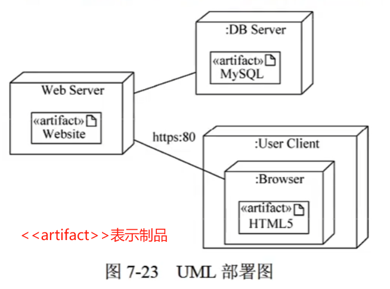

  UML 图总和：

$$
\left\{
\begin{array}{ll}
静态建模:类图、对象图、用例图 \\
动态建模:序列图(顺序图，时序图)、通信图(协作图)、状态图、活动图 \\
物理建模:构件图(组件图)、部署图 \\
交互图:序列图(顺序图，时序图)、通信图(协作图)
\end{array}
\right.
$$
