## 7. 操作系统 - 软件设计师

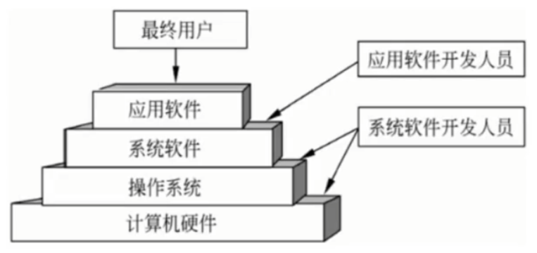

> 编辑程序、汇编程序、编译程序、数据库管理系统等系统软件和应用软件都是建立在操作系统基础上的

**进程管理**（处理机管理）：

前趋图是一个有向无循环图，由结点和有向边构成，结点代表各程序段的操作，而结点间的有向边表示两个程序段操作之间存在的前趋关系。（输入是计算的前趋，计算是输入的后继）

程序顺序执行的特征：顺序性、封闭性、可再现性

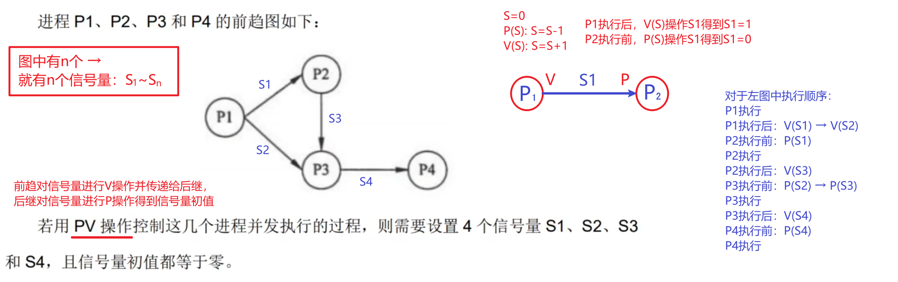

> 如何确定 S~n~对应哪条有向边：
>
> P~1~P~2~ → 12 P~1~P~3~ → 13 P~2~P~3~ → 23 P~3~P~4~ → 34
>
> 根据 12 > 13 > 23 > 34，可得 P~1~P~2~ → S1 P~1~P~3~ → S2 P~2~P~3~ → S3 P~3~P~4~ → S4

程序并发执行的特征：

1. 失去了程序的封闭性
2. 程序和机器的执行程序的活动不再一一对应
3. 并发程序间的相互制约性

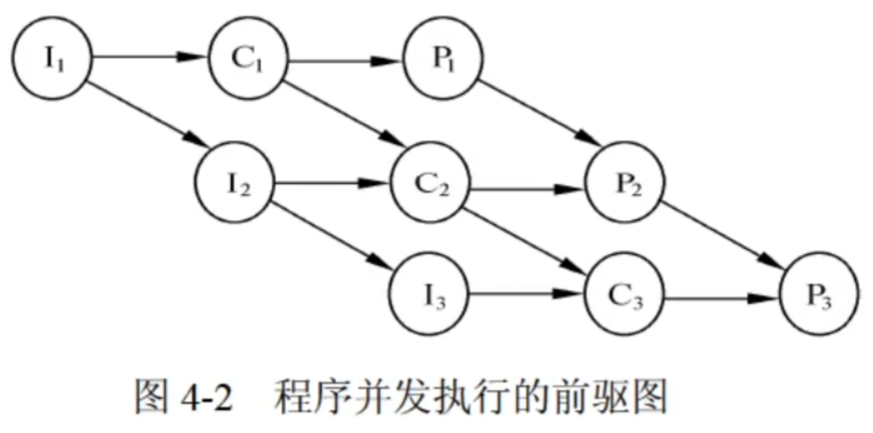

> 图 4-2 中，I~2~与 C~1~并行执行；I~3~、C~2~与 P~1~并行执行；C~3~与 P~2~并行执行。其中，I~2~、I~3~受到 I~1~ 的间接制约，C~2~、C~3~受到 C~1~的间接制约，P~2~、P~3~受到 P~1~ 的间接制约，而 C~1~、P~1~受到 I~1~ 的直接制约，等等。

**进程**是资源分配和独立运行的基本单位

进程的 3 种基本状态：运行、就绪、阻塞

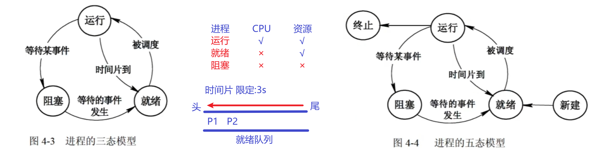

> 例题：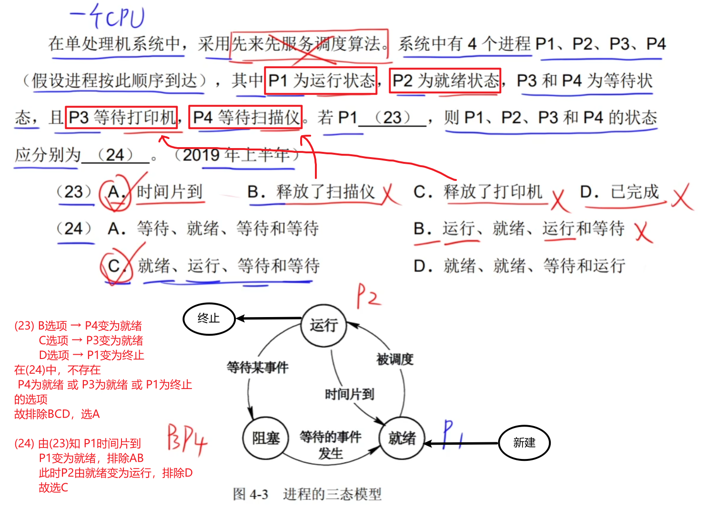

**进程通信**：指各个进程交换信息的过程

同步是合作进程间的直接制约问题，互斥是申请临界资源进程间的间接制约问题。

临界区（进程中对临界资源实施操作的程序段）管理的原则：

1. 有空即进
2. 无空则等
3. 有限等待
4. 让权等待

**信号量**是一个整型变量，根据控制对象的不同被赋予不同的值，分类如下：

1. 公用信号量。实现进程间的互斥，初值为 1 或资源的数目
2. 私用信号量。实现进程间的同步，初值为 0 或某个正整数

> 信号量 S 的物理意义：$S\geq{0}$ 时表示资源的可用数，$S<0$ 时其绝对值表示阻塞队列中等待该资源的进程数

**PV 操作**是实现进程同步与互斥的常用方法，是低级通信原语，在执行期间不可分割。

- P 操作定义：S:=S-1，若$S\geq{0}$，则执行 P 操作的进程继续执行；若$S<0$，则置该进程为阻塞状态（因为无可用资源），并将其插入阻塞队列

- V 操作定义：S:=S+1，若$S>0$，则执行 V 操作的进程继续执行；若$S\leq{0}$，则从阻塞队列中唤醒一个进程，并将其插入就绪队列，然后执行 V 操作的进程继续

> 互斥情况下，P、V 成对出现

- 利用 PV 操作实现进程的互斥：令信号量 mutex 的初值为 1，当进入临界区时执行 P 操作，退出临界区时执行 V 操作。

- 利用 PV 操作实现进程的同步：

  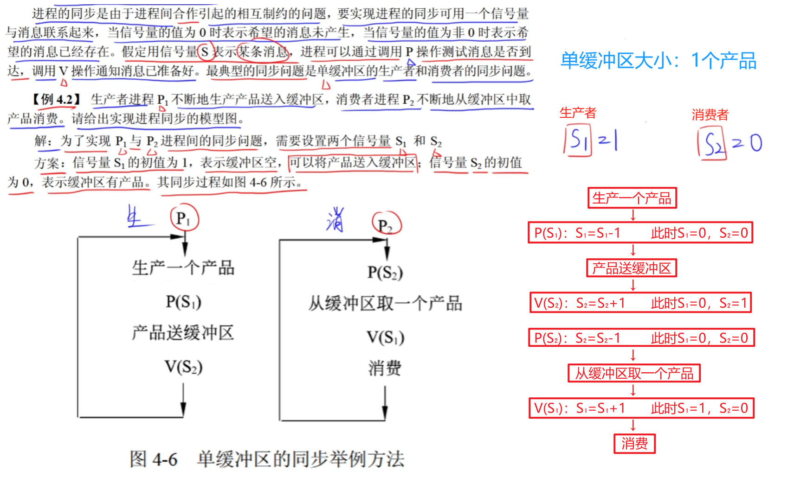

  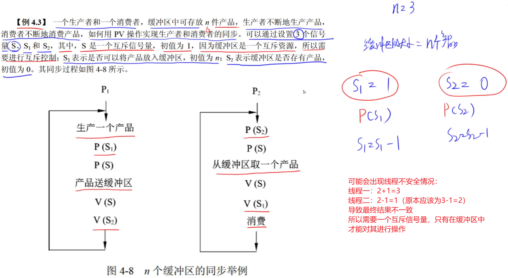

> 例题：
>
> 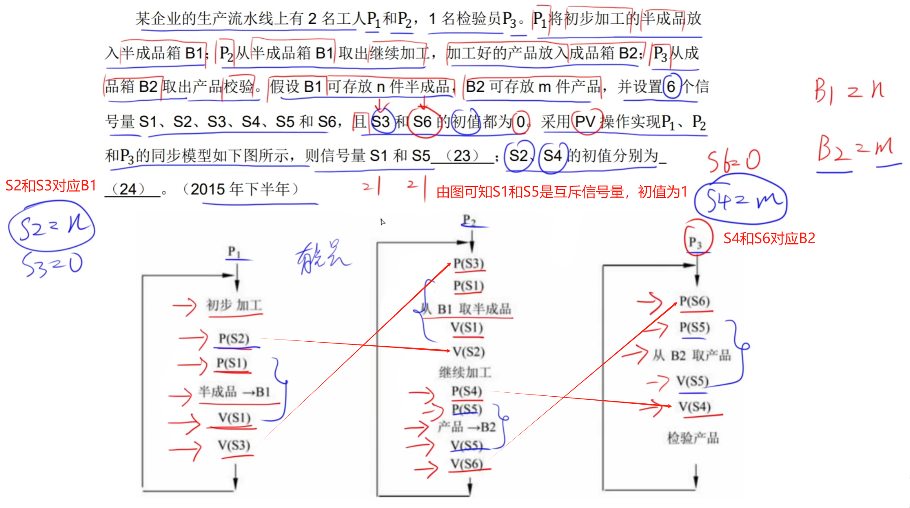

**死锁**：

当有 n 个进程、m 个资源、且每个进程所需要的资源数为 k，并且系统采用的分配策略是轮流地为每个进程分配资源时，判断是否会发生死锁的公式如下：

$$
m\geq{n(k-1)+1}
$$

> 结果为真就不会发生死锁，为假就会发生死锁
>
> 解释：此时每个进程都分配了$(k-1)$个资源，只需要再分配 1 个资源让其中一个进程运行完成，即不会发生死锁

**进程资源图**：

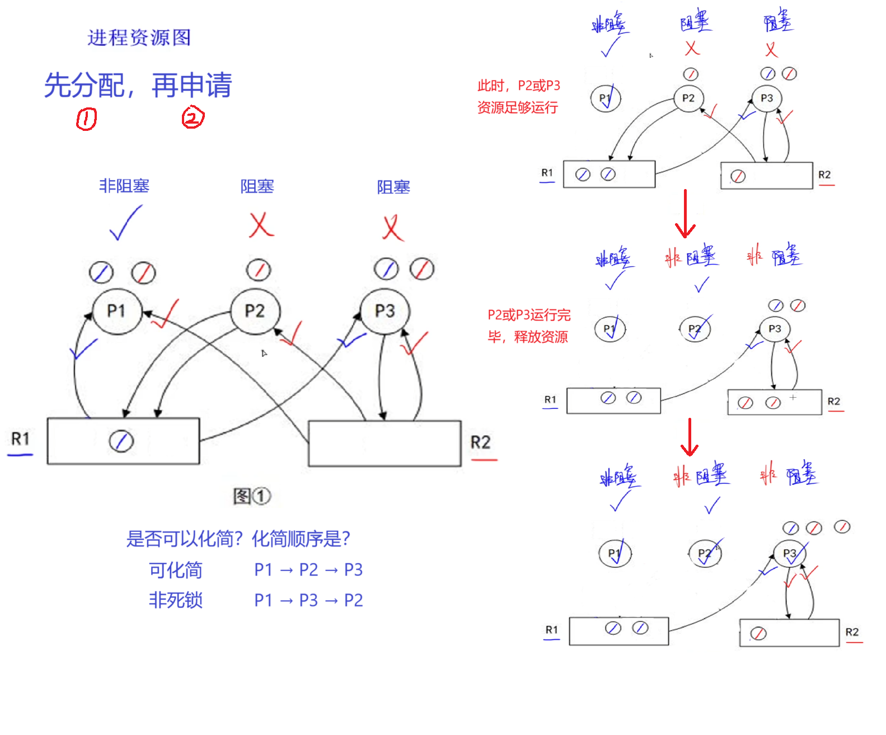

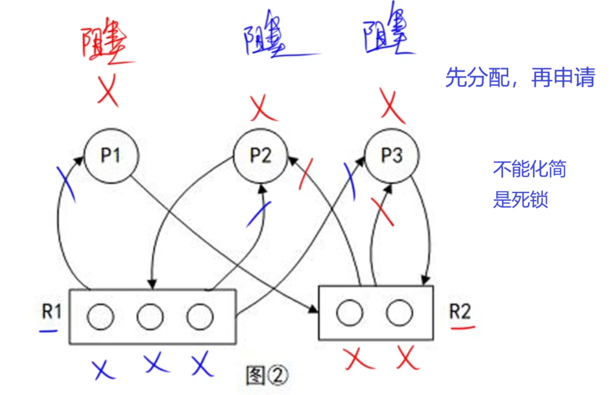

**死锁避免：**

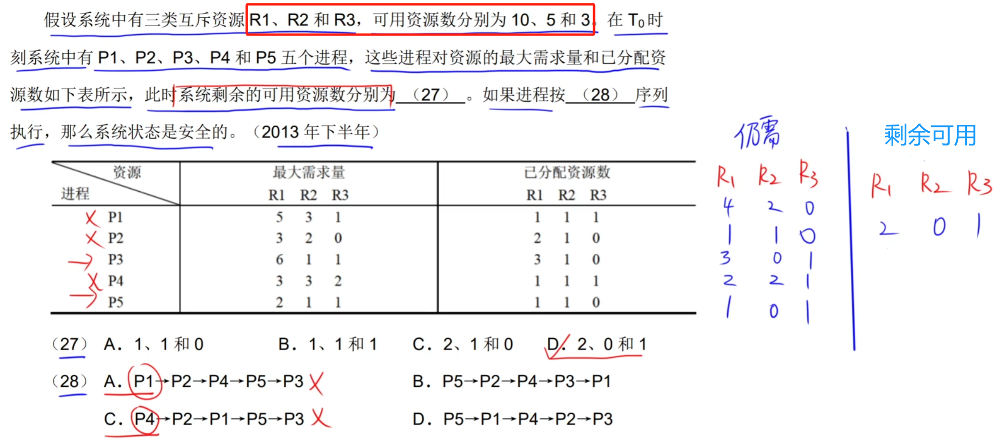

> 解题思路：
>
> （1）$R_n剩余可用资源数=R_n的可用资源数 - R_n已分配资源数$
>
> （2）此时剩余可用资源数：$R_1→2，R_2→0，R_3→1$ ，只能满足 P5 仍需的资源数：$R_1→1，R_2→0，R_3→1$
> 故排除 A 和 C；
> P5 运行完毕后返回系统资源，剩余可用资源数变为：$R_1→3，R_2→1，R_3→1$，只能满足 P2 仍需的资源数： $R_1→2，R_2→1，R_3→0$，故排除 D（剩余顺序推导过程同上）

**线程**：可独立调度和分配的基本单位

> 同属一个进程的线程**共享进程**所拥有的全部**资源**（线程间是不可见的，不能共享线程间的资源）

**局部性原理**：

- 时间局限性：程序中存在着大量的循环操作
- 空间局限性：程序在一段时间内所访问的地址可能集中在一定的范围内，原因：程序是顺序执行的

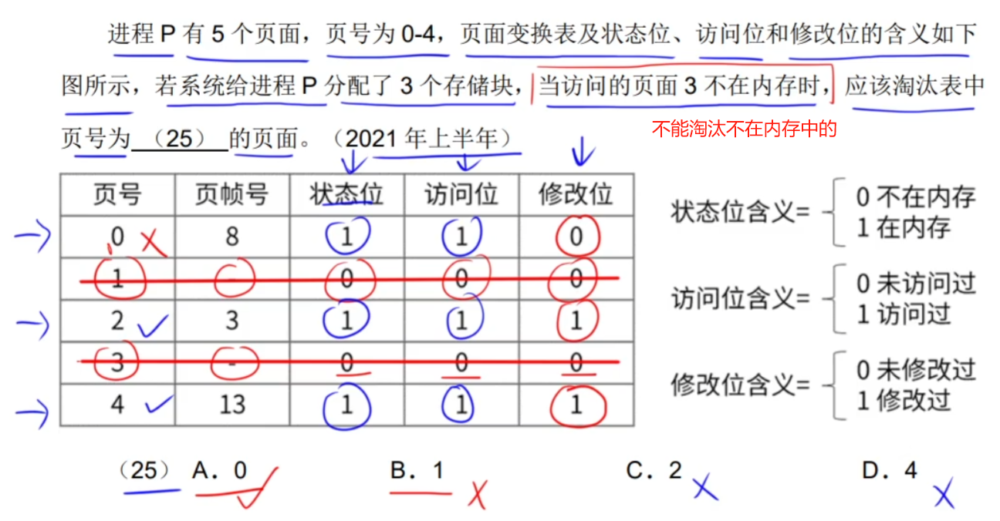

> 页号 1 和 3 不在内存中，故排除 1 和 3；在剩下的页号中按 “状态位 → 访问位 → 修改位” 顺序向下找，淘汰值为 1 的页号

**分页存储管理**：

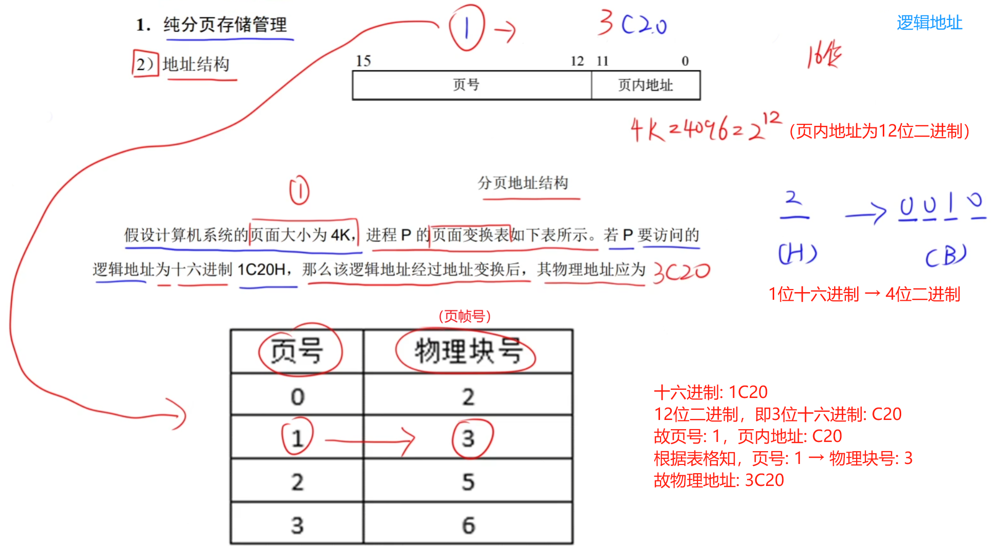

**段页式存储管理**：

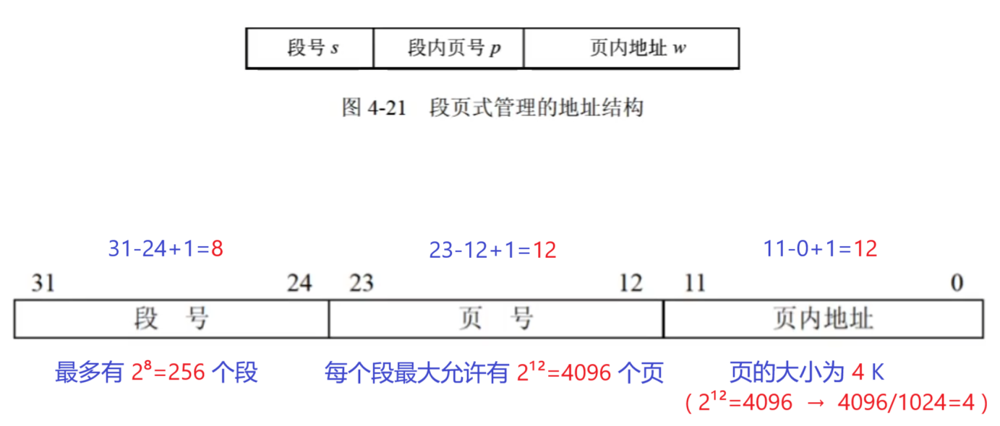

**缓冲区**：缓冲区为空时才可输入，为满时才可输出

- 单缓冲区：

  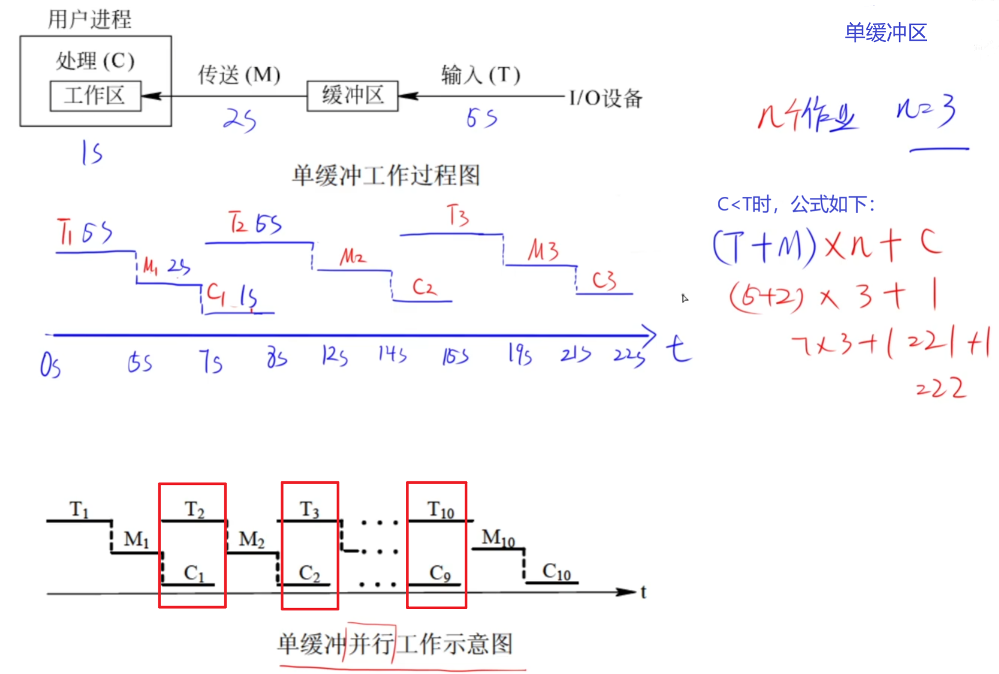

- 双缓冲区：

  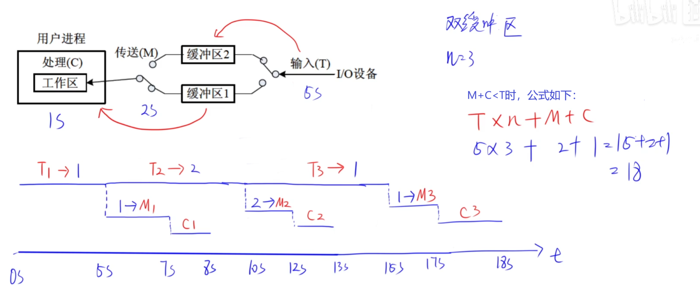

**硬盘调度算法**：（设磁头位于 53，请求顺序为 98、183、37、122、14、124、65、67）

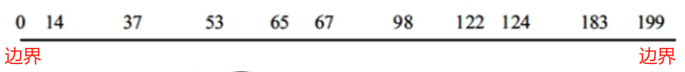

1. 先来先服务（FCFS）

   按照请求顺序移动：53→98→183→37→122→14→124→65→67

2. 最短寻道时间优先（SSTF）

   优先请求距离当前最近的：53→65→67→37→14→98→122→124→183

3. 扫描算法（SCAN）或 电梯调度算法

   从磁头沿指定方向一直移动到尽头，再反向移动：53→37→14→65→67→98→122→124→183

4. 循环扫描算法（CSCAN）或 单向扫描算法

   从磁头沿指定方向一直移动到尽头，再返回到另一个尽头，继续移动构成循环：
   53→65→67→98→122→124→183→14→37

> 从 n → m，$磁头移动=|n-m|$

**旋转调度算法**：

- 文件在磁盘上连续存放：

  $第1个记录耗费时间=读写时间+处理时间$

  $第2\sim{n}个记录耗费时间=(读写头到下一个记录位置的时间+读写时间+处理时间)\times(记录总数-1)$

- 非连续存放：

  $每块读取时间=移动一个磁道所需时间\times{相邻数据块的平均距离}+每块旋转延迟时间+传输时间$

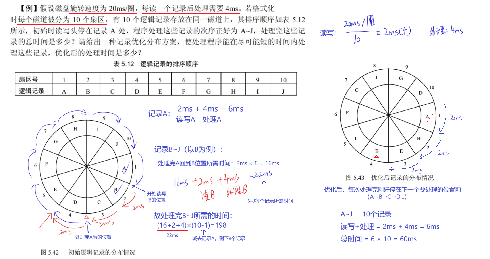

**链式存储结构**：

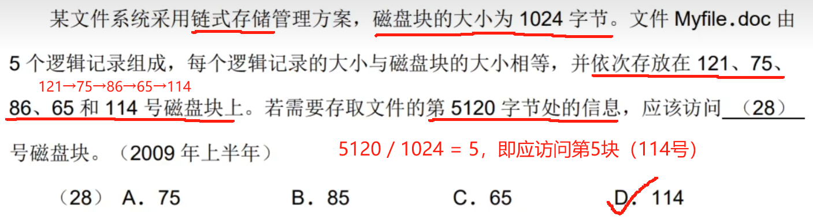

**多级索引结构**：

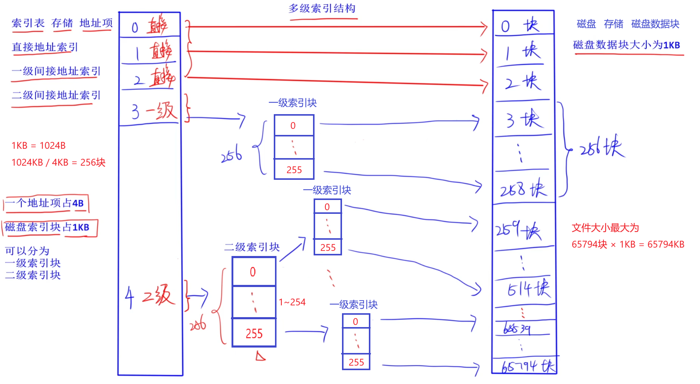

**文件目录**：损坏会对系统造成较大的影响

- 文件控制块，包含三类信息：基本信息类、存取控制信息类、使用信息类
- 目录结构：一级目录结构、二级目录结构、多级目录结构
  - 全文件名：D:\Program\C-prog\f1.c
  - 绝对路径：D:\Program\C-prog\（不用加上文件名）
  - 相对路径：Program\C-prog\ 或 .\C-prog\ 或 C-prog\（当前位于 Program 目录时）

**位示图**：用二进制的一位来表示一个物理块的使用情况；0→ 空闲，1→ 占用

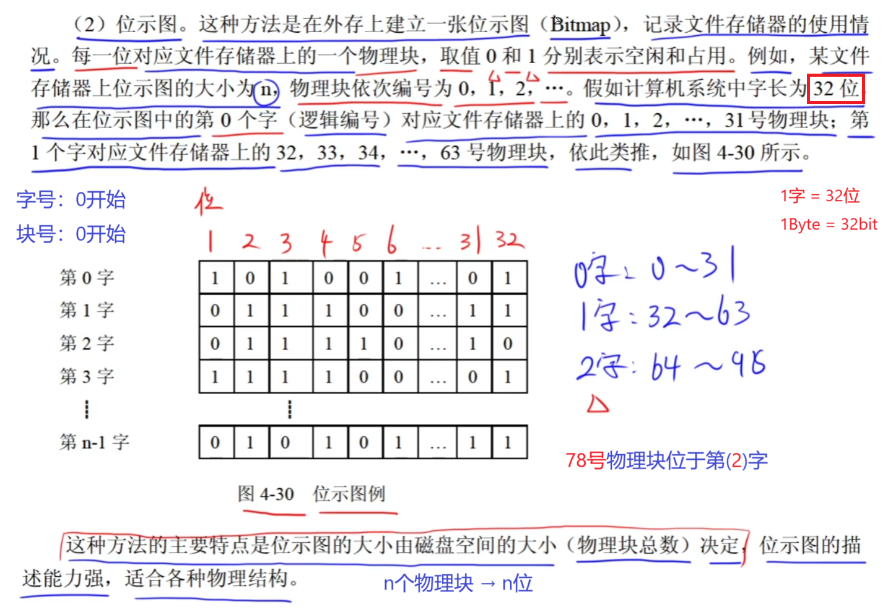

**文件权限**：

文件权限可以用三位八进制数字表示，每一位数字代表所有者（user）、组（group）和其他用户（others）的权限。每个权限位可以是以下组合之一：

- 读取 (r) → 4
- 写入 (w) → 2
- 执行 (x) → 1

> 例题：某个程序所有者拥有所有权限，组成员有读取和运行的权限，其他用户只有运行的权限，该程序的权限为\_\_\_。
>
> - **所有者**：拥有所有权限 $= 4+2+1 = 7$
> - **组成员**：拥有读取和执行权限 $= 4+1 = 5$
> - **其他用户**：只有执行权限 $= 1$
>
> 故该程序的权限为**751**。
