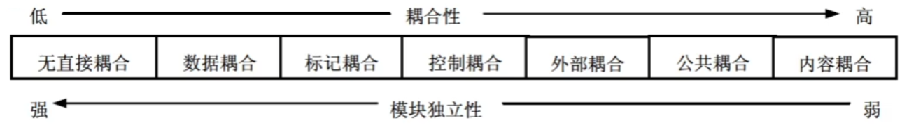
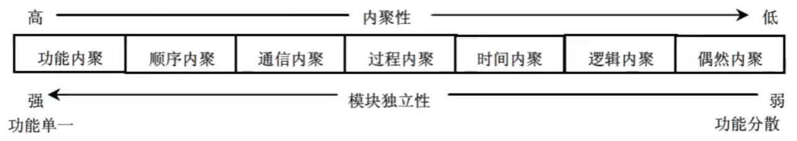

## 8. 结构化开发 - 软件设计师

**系统设计的基本原理**：

1. 抽象

2. 模块化

3. 信息隐蔽

4. 模块独立

   - 衡量模块独立程度的标准：耦合性和内聚性

   - 耦合：取决于各个模块之间接口的复杂程度、调用模块的方式以及通过接口的信息类型等。

     

     - 无直接耦合：两个模块之间**没有直接的关系**，分别从属于不同模块的控制与调用，它们之间不传递任何信息
     - 数据耦合：两个模块之间有调用关系，**传递的是简单的数据值**
     - 标记耦合：两个模块之间**传递的是数据结构**
     - 控制耦合：一个模块调用另一个模块时，**传递的是控制变量**
     - 外部耦合：模块间通过**软件之外的环境**联结
     - 公共耦合：通过一个**公共数据环境**相互作用的那些模块间的耦合
     - 内容耦合：当**一个模块直接使用另一个模块的内部数据**，或通过非正常入口转入另一个模块内部时

   - 内聚：一个内聚程度高的模块（在理想情况下）应当只做一件事

     

     - 偶然内聚（巧合内聚）：一个模块内的各处理元素之间**没有任何联系**
     - 逻辑内聚：模块内**执行若干个逻辑上相似的功能**，通过参数确定该模块完成哪一个功能
     - 时间内聚：把需要**同时执行**的动作组合在一起形成的模块称为时间内聚模块（特定时间）
     - 过程内聚：一个模块完成多个任务，这些任务必须**按指定的过程执行**
     - 通信内聚：模块内的所有处理元素都在同一个**数据结构**上操作，或者各处理使用相同的输入数据或者产生相同的输出数据
     - 顺序内聚：一个模块中的各个处理元素都密切相关于同一功能且必须**顺序执行**，前一个功能元素的输出就是下一个功能元素的输入
     - 功能内聚：模块内的**所有元素共同作用完成一个功能**，缺一不可

   > 在将软件系统划分模块时，应尽量做到**高内聚、低耦合**，提高模块的独立性。

**系统结构设计原则**：

1. 分解-协调原则 → 复杂问题分解成多个小问题，处理过程中根据系统总体要求协调各部门的关系
2. 自顶向下原则 → 抓住系统总的功能目的，逐层分解，先确定上层模块的功能，再确定下层模块的功能
3. 信息隐蔽、抽象的原则 → 上层模块只规定下层模块做什么和所属模块间的协调关系，但不规定怎么做
4. 一致性原则 → 保证整个软件设计过程中具有统一的规范、统一的标准和统一的文件模式等
5. 明确性原则 → 每个模块必须功能明确、接口明确，消除多重功能和无用接口
6. 模块之间的耦合尽可能小，模块的内聚度尽可能高。
7. 模块的扇入系数和扇出系数要合理。
   一个模块直接调用其他模块的个数称为模块的扇出系数；一个模块被其他模块调用时，直接调用它的模块个数称为模块的扇入系数
8. 模块的规模适当。
9. 模块的作用范围应该在其控制范围之内。

**系统文档**：

1. 用户与系统分析人员在系统规划和系统分析阶段通过文档进行沟通
   - 文档：可行性研究报告、总体规划报告、系统开发合同和系统方案说明书等
2. 系统开发人员与项目管理人员通过文档在项目期内进行沟通
   - 文档：系统开发计划（包括工作任务分解表、PERT 图、甘特图和预算分配表等）、系统开发月报以及系统开发总结报告等项目管理文件
3. 系统测试人员与系统开发人员通过文档进行沟通
   - 系统测试人员可以根据系统方案说明书、系统开发合同、系统设计说明书和测试计划等文档对系统开发人员所开发的系统进行测试
   - 系统测试人员再将评估结果撰写成系统测试报告
4. 系统开发人员与用户在系统运行期间进行沟通
   - 用户通过系统开发人员撰写的文档（用户手册和操作指南）运行系统
5. 系统开发人员与系统维护人员通过文档进行沟通
   - 文档：系统设计说明书和系统开发总结报告
6. 用户与维修人员在运行维护期间进行沟通
   - 用户在使用信息系统的过程中，将运行过程中的问题进行记载，形成系统运行报告和维护修改建议
   - 系统维护人员根据维护修改建议以及系统开发人员留下的技术手册等文档对系统进行维护和升级

**数据流图**：对系统的功能和功能之间的数据流进行建模

- 顶层数据流图（父图）描述了系统的输入和输出

**数据字典**：为数据流图中（除外部实体外）的每个数据流、文件、加工，以及组成数据流或文件的数据项做出说明

- 数据字典有 4 类条目：数据流、数据项（组成数据流和数据存储的最小元素）、数据存储、基本加工

- 对加工的描述称为 “小说明” 或 “加工逻辑说明”，常用的加工逻辑描述方法有以下 3 种：

  - 结构化语言：一种介于自然语言和形式化语言之间的半形式化语言，是自然语言的一个受限子集

    结构分为内层和外层

    外层：用来描述控制结构，采用 顺序结构、选择结构、重复结构 3 种基本结构

  - 判定表（决策表）：能够清楚地表示复杂的条件组合与应做的动作之间的对应关系

  - 判定树：判定表的变形，更易于理解和使用
