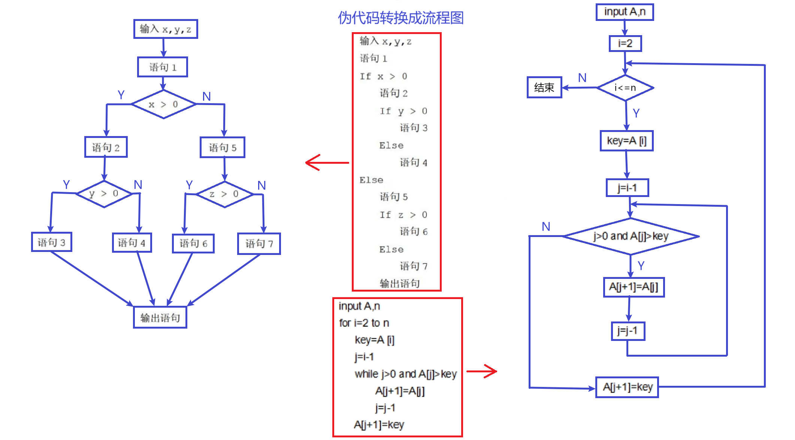
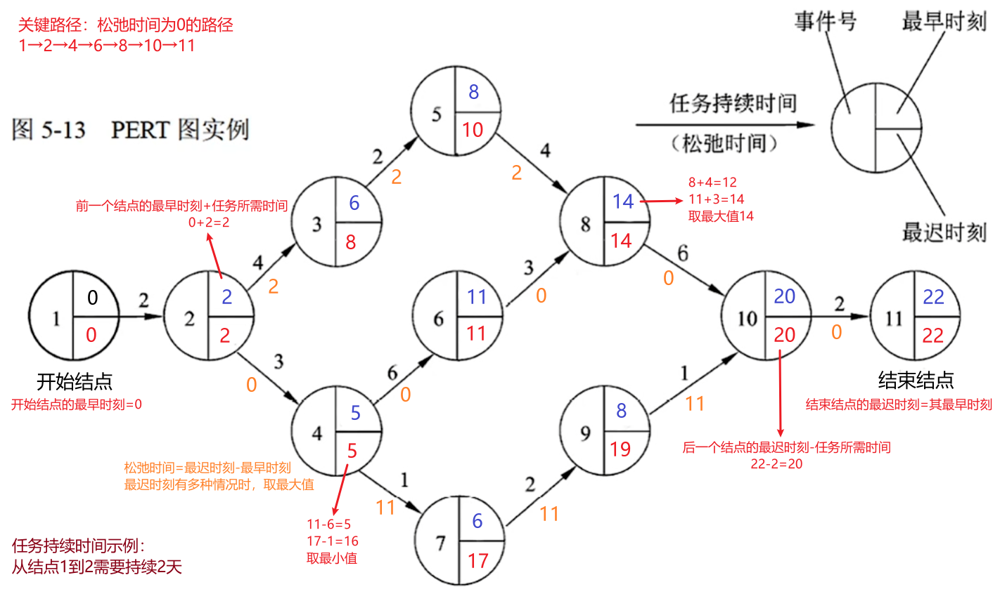
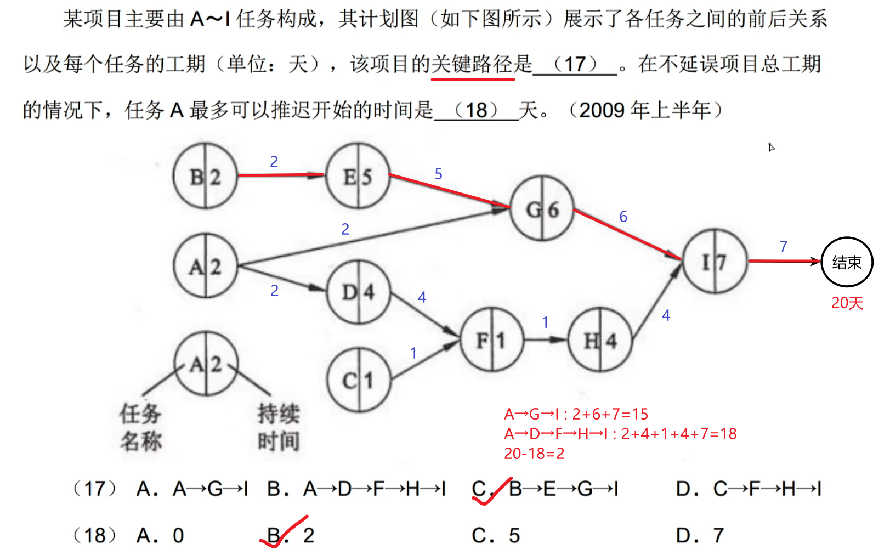
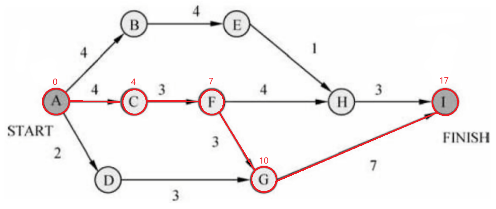
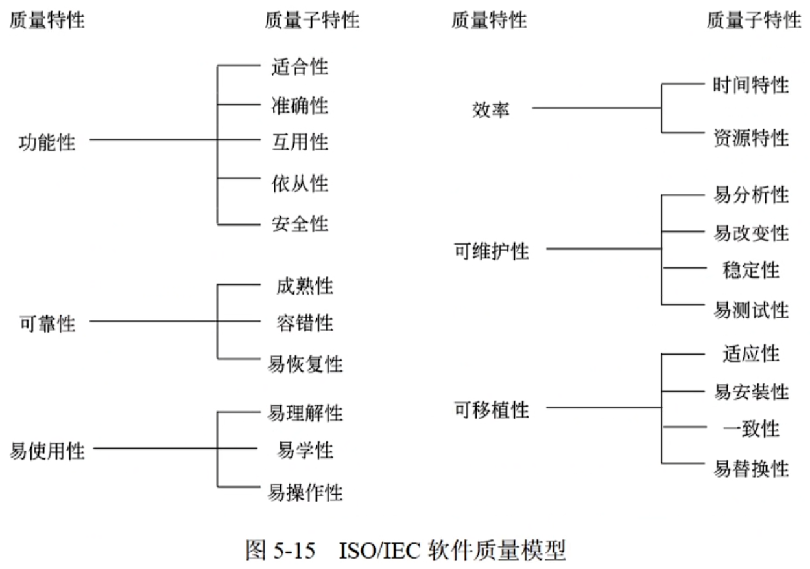
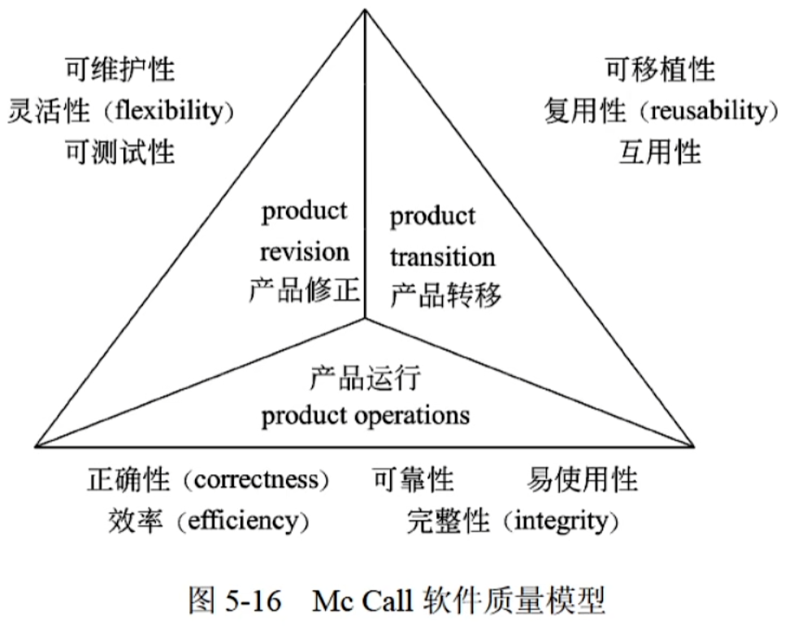

## 9. 软件工程 - 软件设计师

**软件过程**：

- 能力成熟度模型（CMM）

  1. 初始级（Initial）

     软件过程的特点是杂乱无章，有时甚至很混乱，几乎没有明确定义的步骤，项目的成功完全依赖个人的努力和英雄式核心人物的作用

  2. 可重复级（Repeatable）

     建立了基本的项目管理过程和实践来跟踪项目费用、进度和功能特性，有必要的过程准则来重复以前在同类项目中的成功

  3. 已定义级（Defined）

     管理和工程两方面的软件过程已经文档化、标准化，并综合成整个软件开发组织的标准软件过程。所有项目都采用根据实际情况修改后得到的标准软件过程来开发和维护软件

  4. 已管理级（Managed）

     制定了软件过程和产品质量的详细度量标准。软件过程的产品质量都被开发组织的成员所理解和控制

  5. 优化级（Optimized）

     加强了定量分析，通过来自过程质量反馈和来自新观念、新技术的反馈使过程能不断持续地改进

- 能力成熟度模型集成（CMMI）

  1. 阶段式模型
     - 初始的：过程不可预测且缺乏控制
     - 已管理的：过程为项目服务
     - 已定义的：过程为组织服务
     - 定量管理的：过程已度量和控制
     - 优化的：集中于过程改进
  2. 连续式模型
     - CL~0~（未完成的）：过程域未执行或未得到 CL~1~中定义的所有目标
     - CL~1~（已执行的）：其共性目标是过程将可标识的输入工作产品转换成可标识的输出工作产品，以实现支持过程域的特定目标
     - CL~2~（已管理的）：其共性目标集中于已管理的过程的制度化
     - CL~3~（已定义级的）：其共性目标集中于已定义的过程的制度化
     - CL~4~（定量管理的）：其共性目标集中于可定量管理的过程的制度化
     - CL~5~（优化的）：使用量化（统计学）手段改变和优化过程域，以满足客户要求的改变和持续改进计划中的过程域的功效

**软件过程模型**：

- 瀑布模型：需求明确/不发生变化，具备相关领域及类似规模系统的开发经验

  - 优点：容易理解，管理成本低；强调开发的阶段性早期计划及需求调查和产品测试
  - V 模型：瀑布模型的一个变体

- 增量模型：能够快速构造可运行产品，根据后续增量加入新功能，是瀑布模型的一个变体

  - 优点：具有瀑布模型的所有优点；第一个可交付版本所需成本和时间很少；开发由增量表示的小系统所承担的风险不大；运行增量投资

- 演化模型：迭代的过程模型，尽快投入使用，逐步开发出完整的软件版本，适用于对软件需求缺乏准确认识的情况

  - 原型模型：用户需求不清、需求经常变化；系统规模不大、不复杂；能快速、低成本地构建原型
  - 螺旋模型：适用于庞大、复杂并且具有高风险的系统；强调风险分析；结合了瀑布模型和演化模型

- 喷泉模型：以用户需求为动力，以对象作为驱动的模型，适合面向对象的开发方法；支持软件重用和多项开发活动集成的局限性；开发过程具有迭代性和无间隙性 → 开发活动重复多次，不存在明显边界

  - 优点：提高软件项目的开发效率，节省开发时间
  - 缺点：开发过程需要大量人员，不利于项目管理；要求严格管理文档，使得审核难度加大

- 统一过程（UP）模型：用例和风险驱动，以架构为中心，迭代并且增量；每个迭代有 5 个核心工作流

  1. 起始阶段：生命周期目标 — 专注于项目的初创活动
  2. 精化阶段：生命周期架构 — 进行需求分析和架构演进
  3. 构建阶段：初始运作功能 — 关注系统的构建，产生实现模型
  4. 移交阶段：产品发布 — 关注于软件提交方面的工作，产生软件增量

- 敏捷方法：尽可能早地、持续地对有价值的软件的交付；每一种方法基于一套原则

  - 极限编程（XP）：轻量级（敏捷）、高效、低风险、柔性、可预测的、科学的软件开发方式

    - 4 大价值观：沟通、简单性、反馈、勇气
    - 5 个原则：快速反馈、简单性假设、逐步修改、提倡更改、优质工作
    - 12 个最佳实践：计划游戏、小型发布、隐喻、简单设计、测试先行、重构、结对编程、集体代码所有制、持续集成、每周工作 40 个小时、现场客户、编码标准

  - 水晶法（Crystal）：每一个不同的项目都需要一套不同的策略、约定和方法论

  - 并列争求法（Scrum）：每 30 天一次的迭代称为一个 “冲刺”，并按需求的优先级别来实现产品

  - 自适应软件开发（ASD）：有 6 个基本原则

  - 敏捷统一过程（AUP）：采用 “在大型上连续” “在小型上迭代” 原理构建系统，采用经典的 UP 阶段性活动

    每个 AUP 迭代执行的活动：建模、实现、测试、部署、配置及项目管理、环境管理

**需求分析**：

- 软件需求：功能需求、性能需求、用户或人的因素、环境需求、界面需求、文档需求、数据需求、资源使用需求、安全保密需求、可靠性需求、软件成本消耗与开发进度需求、其他非功能性需求

**系统设计**：

- 概要设计
  1. 设计软件系统总体结构：把一个复杂的系统按功能划分成模块；确定每个模块的功能；确定模块之间的调用关系；确定模块之间的接口
  2. 数据结构及数据库设计
     - 数据结构的设计
     - 数据库的设计：概念设计、逻辑设计、物理设计
  3. 编写概要设计文档：概要设计说明书、数据库设计说明书、用户手册、修订测试计划
  4. 评审
- 详细设计
  1. 对每个模块进行详细的算法设计
  2. 对模块内的数据结构进行设计
  3. 对数据库进行物理设计
  4. 其他设计：代码设计、输入/输出格式设计、用户界面设计
  5. 编写详细设计说明书
  6. 评审

**系统测试**：保证系统质量和可靠性的关键步骤，需要遵循以下基本原则：

1. 应尽早并不断地进行测试
2. 测试工作应该避免由原开发软件的人或小组承担
3. 在设计测试方案时，不仅要确定输入数据，而且要根据系统功能确定预期输出结果
4. 在设计测试用例时，不仅要设计有效、合理的输入条件，也要包含不合理、失效的输入条件
5. 在测试程序时，不仅要检验程序是否做了该做的事，还有检验程序是否做了不该做的事
6. 严格按照测试计划来进行，避免测试的随意性
7. 妥善保存测试计划、测试用例，作为软件文档的组成部分，为维护提供方便
8. 测试用例都是精心设计出来的，可以为重新测试或追加测试提供方便
9. **系统测试阶段的测试目标来自于需求分析阶段**

**测试策略**：

- 单元测试
  - 主要检查 模块缺口、局部数据结构、重要的执行路径、出错处理、边界条件
  - 驱动模块（主程序）、桩模块（代替子模块，其内部可进行少量的数据处理）
- 集成测试
  - 自顶向下集成测试：不用编写驱动模块，需要编写桩模块
  - 自底向上集成测试：需要编写驱动模块，不用编写桩模块
  - 回归测试：软件发生变更后，重新测试，防止变更所带来的错误
  - 冒烟测试：时间关键项目的决定性机制
- 确认测试
- 系统测试

**测试方法**：

1. 静态测试：被测程序不在机器上运行

   - 人工测试
   - 计算机辅助静态分析

2. 动态测试：通过运行程序发现错误

   - 黑盒测试（功能测试）：不考虑软件的内部结构和特性

     - 等价类划分 → 有效等价类（符合规则）、无效等价类（不符合规则）
     - 边界值分析 → 选取边界值进行测试
     - 错误推测 → 基于经验和直觉推测程序中的错误
     - 因果图

   - McCabe 度量法

     有向图 G 的环路复杂性的公式：$V(G)=m-n+2$

     > 其中 V(G)是有向图 G 的环路个数，m 是 G 中的有向弧数（箭头），n 是 G 中的节点数

   - 白盒测试（结构测试）：根据程序内部结构和逻辑设计测试用例

     1. 逻辑覆盖（从弱到强）

        - 语句覆盖：选择足够的测试数据，使得程序中每条语句至少执行一次

        - 判定覆盖（分支覆盖）：设计足够的测试用例，使得程序中每个判定表达式至少获得一次“真”和“假”值，或每一个取“真”分支和取“假”分支至少都通过一次

        - 条件覆盖：构造一组测试用例，使得每一判定语句中每个逻辑条件的各种可能的值至少满足一次

        - 判定/条件覆盖：设计足够的测试用例，使得判定中每个条件的所有可能取值（真/假）至少出现一次，并使每个判定本身的判定结果（真/假）也至少出现一次

        - 条件组合覆盖：设计足够的测试用例，使得每个判定中条件的各种可能值的组合都至少出现一次

          > 满足条件组合覆盖的测试用例是一定满足判定覆盖、条件覆盖、判定/条件覆盖的

        - 路径覆盖：覆盖被测试程序中所有可能的路径

     2. 循环覆盖：执行足够的测试用例，使得循环中的每个条件都得到验证

     3. 基本路径覆盖：在程序控制流图的基础上通过分析控制流图的环路复杂性，导出基本可执行路径集合

     > 白盒测试原则：
     >
     > 1. 程序模块中的所有独立路径至少执行一次
     > 2. 在所有的逻辑判断中，取 “真” 和取 “假” 的两种情况至少都能执行一次
     > 3. 每个循环都应在边界条件和一般条件下各执行一次
     > 4. 测试程序内部数据结构的有效性等

     

**系统维护概述**：

- 系统可维护性的评价指标：可理解性、可测试性、可修改性

- 软件与维护文档：软件系统的文档可分为用户文档和系统文档

  - 文档是软件可维护性的决定因素，高质量文档对于软件产品的效益有着重要意义

- 系统维护

  - 硬件维护
  - 软件维护
    1. 正确性维护：改正系统开发阶段已发生而测试阶段尚未发现的错误
    2. 适应性维护：使应用软件适应信息技术变化和管理需求变化而进行修改
    3. 完善性维护：为扩充功能和改善性能而进行的修改
    4. 预防性维护：为适应环境变化，主动增加预防性的新功能
  - 数据维护

- 软件的质量属性：用 0~1 之间的数来度量

  - 可靠性：一个系统对于给定的时间间隔内、在给定条件下无失效运作的概率

    用$\frac{MTTF}{1+MTTF}$来度量，其中 MTTF 为平均无故障时间

  - 可用性：在给定的时间点上，一个系统能够按照规格说明正确运作的概率

    用$\frac{MTBF}{1+MTBF}$来度量，其中 MTBF 为平均失效间隔时间

  - 可维护性：在给定的使用条件下，在规定的时间间隔内，使用规定的过程和资源完成维护活动的概率

    用$\frac{1}{1+MTTR}$来度量，其中 MTTR 为平均修复时间

**沟通路径**（人数为 n 时）：

- 无主程序员组：$沟通路径=\frac{(n-1)\times{n}}{2}$
- 主程序员组：$沟通路径=n-1$

**软件项目估计**：

- COCOMO 估算模型
  - 基本 COCOMO 模型：静态单变量模型
  - 中级 COCOMO 模型：静态多变量模型
  - 详细 COCOMO 模型：将软件系统模型分为系统、子系统、模块 3 个层次
- COCOMOII 模型
  - 应用组装模型 → 对象点
  - 早期设计阶段模型 → 功能点
  - 体系结构阶段模型 → 代码行

**进度管理**：

- Gantt 图（甘特图）：能清晰地描述每个任务从何时开始，到何时结束，任务的进展情况以及各个任务之间的并行性；但不能清晰地反映出各任务之间的依赖关系，难以确定整个项目的关键所在，不能反映计划中有潜力的部分

  ```mermaid
  gantt
  	title Gantt图实例
  	section 任务1
  	task1:a1,2008-01-01,180d
  	section 任务2
  	task2:a1,2008-02-01,270d
  	section 任务3
  	task3:a1,2008-07-01,150d
  ```

- 项目计划评审技术（PERT）图：反映出任务之间的依赖关系，但不能反映任务之间的并行关系

  - 有向图，箭头表示任务（上面标记完成该任务所需时间），图中结点表示流入（指向）结点的任务结束，并开始流出（指向）结点的任务
  - 只有当流入该结点的所有任务都结束时，结点所表示的事件才出现，流出结点的任务才可以开始
  - 最早时刻：在此时刻之前从该事件出发的任务不可能开始
  - 最迟时刻：从事件出发的任务必须在此时刻之前开始
  - 松弛时间：在不影响整个工期的前提下完成该任务有多少机动余地

  

  > 做题技巧：关键路径选最长时间的路径，$任务N最多可以推迟开始的时间=工期时间-其最长时间路径耗费的时间$
  >
  > 

- 项目活动图：顶点表示项目里程碑，连接顶点的边表示活动，边上的值表示完成活动所需的时间

  缩短关键路径上的活动才能缩短整个项目的工期

  

  > 关键路径为 A→C→F→G→I，即最长路径；关键路径长度为 4+3+3+7=17；里程碑 A、C、F、G、I 和活动 AC、CF、FG、GI 在关键路径上；活动 FH 的松弛时间是$最迟时刻-最早时刻$，即(17-4-3)-7=3

**软件配置管理**：

- 主要目标：变更标识、变更控制、版本控制、确保变更正确的实现、变更报告
- 主要内容
  - 版本 1：版本管理、配置支持、变更支持、过程支持、团队支持、变化报告、审计支持
  - 版本 2：软件配置标识、变更管理、版本控制、系统建立、配置审核、配置状态报告
- 配置数据库：开发库、受控库、产品库

**风险管理**：

- 软件风险：不确定性和损失
- 项目风险：项目复杂度、规模及结构不确定性
- 技术风险：设计、实现、接口、验证、维护等方面的潜在问题
- 商业风险：市场风险、策略风险、销售风险、管理风险、预算风险

风险识别：建立风险条目检查表

风险因素：性能、成本、支持、进度

风险预测（风险估计）：风险预测活动（风险发生的可能性）、评估风险影响（风险发生所产生的后果）

风险评估：一种对风险评估很有用的技术就是定义风险参照水准

风险控制：风险避免、风险监控、RMMM 计划（监控和管理计划）

**软件质量特性**：

- ISO/IEC 9126 软件质量模型

  

- McCall 软件质量模型：三层模型框架 → 质量特性、评价准则、度量指标

  

**软件评审**：

- 设计质量
  1. 评价软件的规格说明是否合乎用户的要求
  2. 评审可靠性，即是否能避免输入异常、硬件失效及软件失效所产生的失效
  3. 评审保密措施实现情况，即是否对系统使用资格进行检查
  4. 评审操作特性实施情况，即操作命令和操作信息的恰当性；输入数据与输入控制语句的恰当性；输出数据的恰当性；应答时间的恰当性等
  5. 评审性能实现情况，即是否达到所规定性能的目标值
  6. 评审软件是否具有可修改性、可扩充性、可互换性和可移植性
  7. 评审软件是否具有可测试性
  8. 评审软件是否具有复用性
- 程序质量
  1. 功能结构：数据结构、功能结构、数据结构与功能结构之间的对应关系
  2. 功能的通用性
  3. 模块的层次
  4. 模块结构：控制流结构、数据流结构、模块结构与功能结构之间的对应关系
  5. 处理过程的结构
- 与运行环境的接口
  1. 与硬件的接口
  2. 与用户的接口
- 正式技术评审：揭露质量问题，发现软件中的错误

**软件容错技术**：

- 结构冗余：静态冗余、动态冗余、混合冗余
- 信息冗余：为检测或纠正信息在运算或传输中的错误需外加一部分信息
- 时间冗余：以重复执行指令或程序来消除瞬时错误带来的影响
- 冗余附加技术
  - 在屏蔽硬件错误的容错技术中：
    - 关键程序和数据的冗余存储及调用；检测、表决、切换、重构、纠错和复算的实现
  - 在屏蔽软件错误的容错系统中：
    - 冗余备份程序的存储及调用；实现错误检测和错误恢复的程序；实现容错软件所需的固化程序

**软件工具**：

- 软件开发工具：需求分析工具、设计工具、编码与排错工具、测试工具
- 软件维护工具：版本控制工具、文档分析工具、开发信息库工具、逆向工程工具、再工程工具
